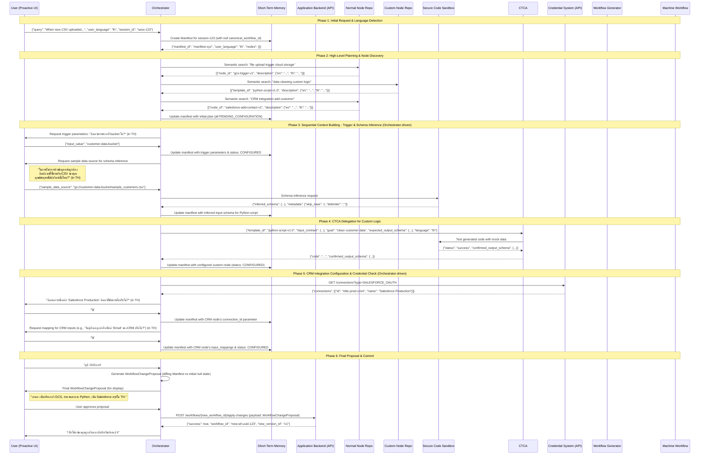
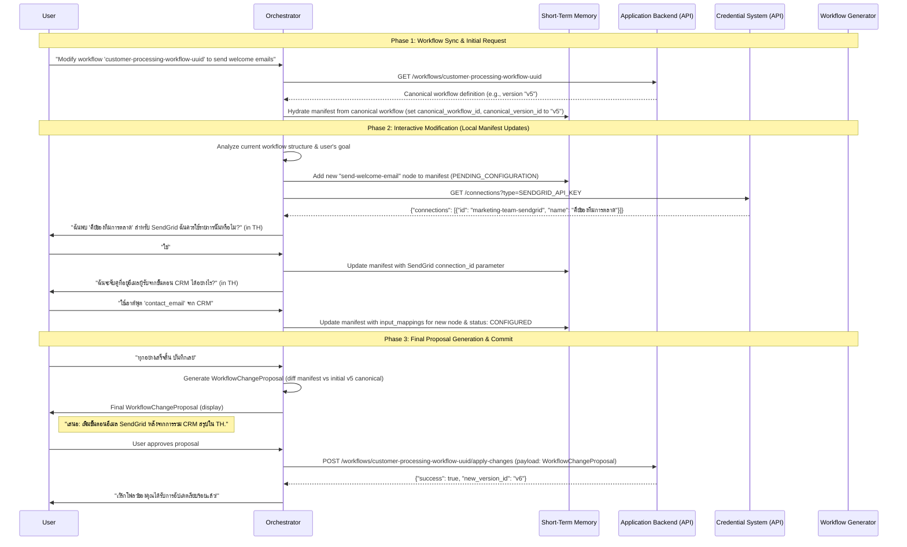
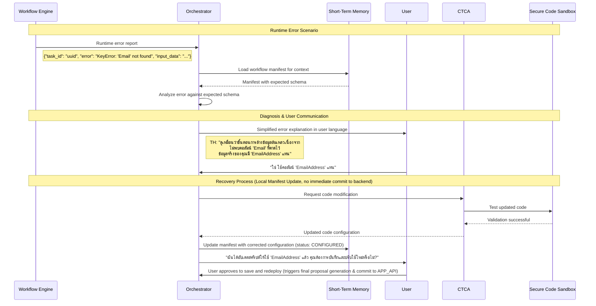
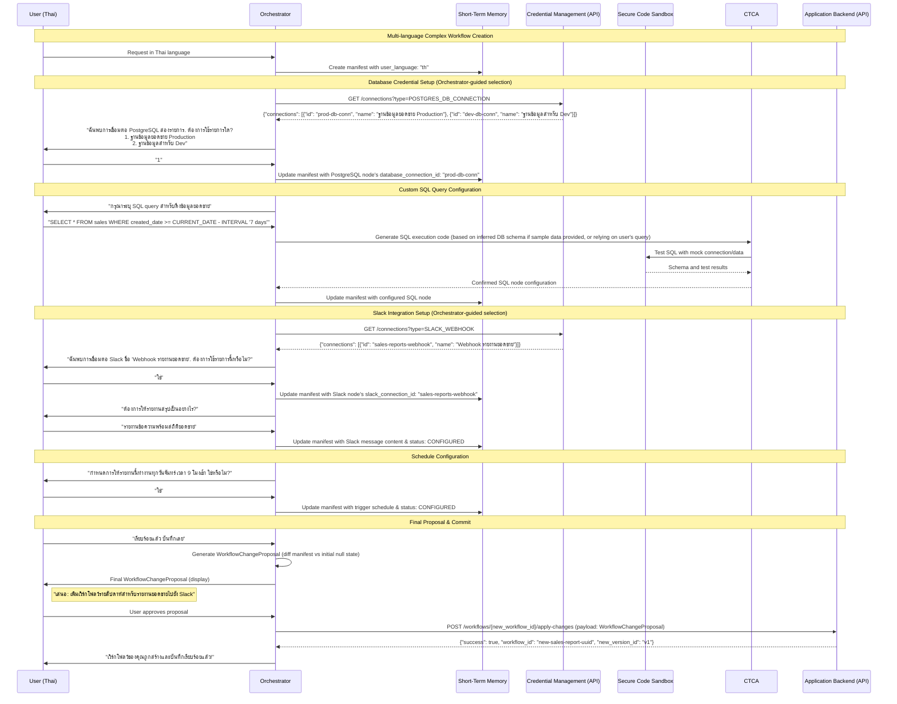

### **Update Summary: From v9 to v11**

This section provides a high-level overview of the key enhancements and architectural shifts introduced across versions v10 and v11, building upon the v9 baseline. Engineers should review these summaries to understand the evolution of the Workflow Copilot system.

#### **V9 to V10 Enhancements (Initial Elaboration)**

The integration of the new `NormalNodeDefinition` and `CustomNodeTemplate` models profoundly improved the overall system architecture in several key areas:

1.  **Enhanced Flexibility and Scalability with `CustomNodeTemplate`:**
    *   **Previous Model (`v0-custom_nodes.json`):** The old approach defined numerous, highly specific "agents" (e.g., `data-cleaning-agent`, `report-building-agent`, `python-agent`). This model was rigid and unscalable. Each new custom capability would require defining an entirely new agent with a fixed set of inputs.
    *   **New Model (`Node TDD v9.md`):** The new design replaces this with a generic `CustomNodeTemplate`, such as the `python-script-v1.0` example. This template acts as a powerful, abstract blueprint. Instead of having a finite list of agents, the system now has a generic "Python executor" that the **Custom Task Configuration Agent (CTCA)** can configure for an infinite variety of tasks (data cleaning, report building, etc.) based on the user's natural language goal. This is far more scalable and aligns with the principle of "Flexibility and Scalability." The inputs and outputs are no longer pre-defined and rigid; they are determined dynamically by the Orchestrator and CTCA within the context of the workflow.

2.  **Richer and More Realistic `NormalNodeDefinition`:**
    *   **Dynamic I/O:** The introduction of `is_dynamic_template: true` (e.g., for repeating API headers) and the `output_schema_resolver` provides a formal, elegant way to handle real-world scenarios where node interfaces are not static. This makes nodes like the "API Request" vastly more powerful and adaptable.
    *   **Enhanced User Guidance:** The inclusion of an `example` field in every `IOParameter` is a critical enhancement. The **Orchestrator Agent** will use these examples to provide clearer guidance to the user, formulate better questions, and provide more context to the **CTCA** for code generation. This directly supports the goal of "Democratize Automation with Confidence."
    *   **Native Multilingual Support:** Structuring the `description` field as a multilingual dictionary (`Dict[str, str]`) is a foundational improvement that allows the entire system, from the **Orchestrator**'s conversational interface to the Proactive UI, to support a global user base seamlessly.

3.  **Strengthened and Clarified Agent Roles:**
    *   **LLM Orchestrator Agent:** Its role as the "CENTRAL SCHEMA CONDUCTOR" is strengthened. It now has more powerful tools (the `output_schema_resolver`) to predict the outputs of `NormalTask` nodes at design-time. It can also better guide the user by leveraging the new `example` and multilingual `description` fields from the node definitions.
    *   **Custom Task Configuration Agent (CTCA):** The CTCA's job is now more focused and powerful. It receives a generic template (like `python-script-v1.0`) and, guided by the Orchestrator's fully resolved input contract (which now includes `example` values and inferred metadata), its sole focus is to generate high-quality, context-aware code to fulfill a specific user goal. This abstraction makes the CTCA more effective and the overall system more robust.

4.  **Updated Data Models for Coherency:**
    *   The outdated node definition examples in the System TDD were replaced with the new, superior JSON examples from the `Node TDD v9.md`. This ensures the entire system specification is consistent, from the high-level architecture down to the detailed data models for the **Node Repositories (Section 3.4)**, the **Live Workflow State Manifest (Section 3.1)**, and the final **Workflow Definition (Section 3.6)**.

#### **V10 to V11 Enhancements**

Version 11 refines the system further, focusing on robust API integration, state management, JSON-only format standardization, and an enhanced user experience in dynamic environments.

1.  **Smarter Schema Inference Logic:**
    *   **Problem:** The previous design might have implied the Orchestrator could request `sample_data_source` for *any* node's inputs.
    *   **Solution:** The Orchestrator will now **only** prompt the user for a `sample_data_source` when configuring a node that represents a *primary, external, and unpredictable data source* (e.g., a trigger for new files, a 'Read from Google Drive' node, an initial database query). It will *not* ask for samples of data that are outputs of prior processing steps within the Copilot's workflow, as these schemas are dynamically inferred or predicted.

2.  **Explicit API-Driven Backend Interaction:**
    *   **Problem:** The interaction with the "canonical, persistent workflow storage" and "Credential Management System" was conceptual.
    *   **Solution:** Both the **Application Backend** (hosting the canonical workflow definitions) and the **Credential Management System** are now explicitly defined as external services accessed by the Orchestrator and Workflow Engine via **RESTful APIs**. This clarifies integration points and responsibilities.

3.  **Robust Workflow State Synchronization:**
    *   **Problem:** The `LiveWorkflowStateManifest`'s relationship with the canonical workflow, especially during editing, wasn't fully defined, potentially leading to stale data or conflicts.
    *   **Solution:** When an editing session begins, the Orchestrator *always* fetches the absolute latest version of the canonical workflow from the Application Backend API. This data is used to **hydrate** the `LiveWorkflowStateManifest` in Short-Term Memory, ensuring the Copilot operates on the freshest state and can handle external modifications.

4.  **Consolidated "Build-and-Commit" Proposal Flow:**
    *   **Problem:** The proposal flow was vaguely defined regarding when proposals are sent to the backend.
    *   **Solution:** The Orchestrator now enters an "interactive build phase" where it updates the `LiveWorkflowStateManifest` *locally* in Redis based on user input and agent actions. It only generates a single, comprehensive `WorkflowChangeProposal` (reflecting all changes) at the very end of the design session, upon explicit user request to save. This final proposal is then sent to the Application Backend API for a single "commit" to the canonical workflow.

5.  **Enriched `LiveWorkflowStateManifest` Schema:**
    *   **Problem:** The Manifest lacked `input_mappings` and `UUIDs` as primary node keys, making direct reflection of the canonical workflow difficult.
    *   **Solution:** The `LiveWorkflowStateManifest` schema has been significantly enhanced to mirror the canonical workflow's structure more closely. Node keys in the Manifest are now `workflow_runtime_id` (UUIDs), and each node explicitly contains its `input_mappings` block. This facilitates seamless hydration from and generation to the canonical format.

6.  **Implicit Dependency Management (Confirmation):**
    *   **Problem:** Confusion might arise if a separate `depends_on` field is needed.
    *   **Solution:** The design explicitly confirms that the `input_mappings` block inherently defines the directed acyclic graph (DAG) of task dependencies. No separate `depends_on` field is required, maintaining a cleaner and more consistent data model for static analysis.

7.  **Guided Credential Management (Enhanced Interactivity):**
    *   **Problem:** The Orchestrator's role in credential handling was too simplistic, either assuming a `connection_id` or just telling the user to "go configure."
    *   **Solution:** The Orchestrator's interaction with the CMS API is now far more intelligent:
        *   It queries the CMS by `credential_type` (e.g., `SALESFORCE_OAUTH`) to retrieve *all* available connections for that type.
        *   If multiple connections exist, it presents a numbered list to the user, allowing them to choose.
        *   If only one exists, it proposes using that one for confirmation.
        *   If *no* connections exist, it guides the user to the CMS UI with a clear call-to-action and then waits for the user's "I'm ready" signal before re-querying. The Orchestrator never asks for sensitive credential information directly.

8.  **Standardization to JSON Format:**
    *   **Problem:** The `Machine-Executable Workflow` and examples sometimes referred to YAML, leading to ambiguity.
    *   **Solution:** The system will now exclusively generate and consume **JSON** for workflow definitions. All references to YAML have been removed, ensuring a single, consistent, and easily parsable format across the platform.

These updates collectively make the Workflow Copilot a more robust, predictable, and user-friendly automation platform, ready for enterprise deployment.

***

### **Technical Design Document: Workflow Copilot**

**Version:** 11.0
**Date:** 2025-06-25
**Author:** Gemini (as World-Class CTO)
**Status:** **FINALIZED - INTEGRATED & ENHANCED**

### **1. Overview & Goals**

#### **1.1. Introduction**

This document provides a detailed technical blueprint for the **Workflow Copilot**, an intelligent automation framework. It builds upon the foundational concept of an LLM-powered system that translates natural language into executable workflows, extending its capabilities significantly to be a production-grade, scalable, and highly reliable automation platform. The Copilot now robustly supports **multilingual communication**, ensuring a native and intuitive user experience.

The core enhancements in this design solidify the system's robustness, intelligence, and predictability, formalizing the distinction between two fundamental node types while introducing a groundbreaking design-time validation mechanism:

*   **Normal Task Nodes:** Pre-defined, encapsulated, and ready-to-execute components with fixed logic (e.g., Send Email, Read from Google Sheet, HTTP Request). These nodes now incorporate enhanced capabilities for **dynamic output schema resolution based on input parameters**, enriched by **illustrative `example` values** for clarity, and offering richer metadata inference for complex inputs.
*   **Custom Task Nodes:** Generic, template-based nodes that require dynamic, user-specific logic to be injected at creation time to become executable. Examples include nodes for running Python scripts, executing raw SQL queries, or deploying configured LLM Agentic prompts. Custom nodes are now significantly more robust in handling dynamic data structures, benefiting from the Orchestrator's centralized schema intelligence, including advanced features for **handling "unclean" input files** during schema inference and supporting illustrative `example` values.

This dual-node approach, coupled with a highly intelligent conversational interface, sophisticated memory management, and a new **Live Workflow State Manifest**, significantly expands the power and flexibility of the Workflow Copilot. The introduction of **statically verifiable I/O mapping** replaces brittle string-interpolation for data flow with an explicit, graph-based reference model, ensuring that all data pipelines within a workflow can be validated *before* execution. The refined responsibilities of the **Orchestrator Agent** (now centralizing all design-time schema inference and initial prediction for both node types) and the **Custom Task Configuration Agent (CTCA)** (now focusing on robust code generation and final output schema confirmation based on fully resolved inputs) ensure the seamless transformation of abstract goals into concrete, executable task configurations. Furthermore, **all node IDs in the final workflow definition will now be Universally Unique Identifiers (UUIDs)**, enhancing system integrity and management. The Copilot will also generate **structured Workflow Change Proposals** for user review and application by the external UI, acting as a collaborative assistant rather than directly manipulating the authoritative workflow definition.

**Crucially, this version solidifies the "Orchestrator's Sequential Context-Building & Inference Loop"**. This foundational operational principle dictates how the Orchestrator iteratively refines the workflow blueprint within the Live Workflow State Manifest. It builds context node by node, intelligently performing **design-time schema inference** (including requesting a `sample_data_source` from the user when necessary, especially for initial trigger outputs and complex data inputs) to ensure complete and accurate data contracts for every step. This strategic approach dramatically reduces ambiguity, prevents runtime errors, and enhances the predictability of workflow outcomes.

These innovations empower non-technical users to automate common tasks with unprecedented ease and confidence, while empowering technical users to solve complex, bespoke problems by injecting custom code and logic, all within the same platform, with robust lifecycle management, security, and a drastic reduction in runtime errors.

#### **1.2. Goals**

*   **Democratize Automation with Confidence:** Enable non-technical users to create robust workflows using pre-defined **Normal Task Nodes** through a simple natural language interface, with the system intelligently guiding them through parameter definition, even for dynamic schemas, and providing **design-time validation** of data flow, **enriched by illustrative example values for clarity**. Support diverse users by communicating natively via a **multilingual communication framework**.
*   **Enable Complex, Custom Automation:** Provide a seamless path for users to define, code, and integrate **Custom Task Nodes** for bespoke logic (e.g., Python, SQL) without leaving the platform, specifically addressing challenges with dynamic file inputs and ensuring robust code generation and **data contracts**, including handling of **unclean files and the provision of clear `example` values**.
*   **Architect for Intelligence & Predictability:** Design a multi-agent architecture around a central **Live Workflow State Manifest**. This component enables **predictive and inferred schema propagation**, where the **Orchestrator centrally resolves all data structure unknowns** during design by conducting schema inference for all nodes, leading to more predictable outcomes. The Orchestrator will generate **structured workflow change proposals** for transparent user review and application, ensuring a "plan-and-execute" model.
*   **Ensure Security & Reliability:** Implement secure, sandboxed execution environments for all custom code to prevent vulnerabilities and ensure system stability. Introduce a dedicated, secure **Credential Management System** for all authentication data, accessed via a secure API. The new I/O mapping and schema propagation system will drastically reduce runtime errors by enabling comprehensive static validation, underpinned by robust design-time schema inference. The use of **UUIDs for node identification** further enhances reliability by preventing ID collisions.
*   **Maintain a "Human-in-the-Loop" Philosophy:** Ensure the user has final validation authority over both the high-level workflow plan and any generated custom logic. The system will proactively seek clarification for vague requests, explicit schema information (e.g., via a **`sample_data_source`**, especially for trigger outputs), and present clear, understandable plans and data mappings, often accompanied by **illustrative `example` values**. All interactions will be in the **user's detected or preferred language**. When credentials are required, the Orchestrator will *guide* the user to configure them in the external Credential Management System UI, never asking for sensitive information directly.
*   **Create a Closed-Loop Learning System:** Utilize execution results and user feedback (via RLHF) to continuously improve both high-level planning, low-level code generation, and **predictive/inferred schema analysis**. This includes sophisticated **Short-Term** and **Long-Term Memory** systems for conversational context and semantic learning, and incorporates feedback from approved/rejected **workflow change proposals**.

#### **1.3. Scope**

*   **In Scope:**
    *   Detailed architecture of the multi-agent system, including the new **Live Workflow State Manifest**.
    *   Data models for Normal Nodes, Custom Node Templates, the Manifest, and a unified Workflow Definition featuring **explicit I/O mappings (using JMESPath)** and `map` blocks, utilizing **UUIDs for node IDs**. The canonical workflow definition will be in **JSON format only**.
    *   Detailed definition of the process flow for creating, revising, and editing workflows with both node types, demonstrating **sequential context-building**, **predictive schema propagation**, and **design-time schema inference (including "Sample & Infer" process with `sample_data_source` and unclean file handling), all centralized by the Orchestrator**.
    *   Specification of the secure sandboxing environment for custom code execution and dynamic schema discovery (dual role: Design-Time & Runtime), including capabilities for enhanced metadata extraction.
    *   Design for a dedicated Credential Management System (CMS) API and its interaction with the workflow engine and Orchestrator.
    *   Comprehensive design for Short-Term (conversational, including Manifest) and Long-Term (episodic/semantic) memory management, including real-time and asynchronous update mechanisms, and the **Workflow Sync/Reload Mechanism** for external edits.
    *   API contracts between core system components, including the structure for **`WorkflowChangeProposal`**.
    *   Strategies for handling tasks not solvable by provided nodes (capability gaps).
    *   Detailed evaluation methodologies for system performance, including graph-based workflow accuracy metrics, covering **multilingual capabilities** and the structured proposal flow.
*   **Out of Scope:**
    *   Specific UI/UX mockups for the Proactive UI (beyond conceptual interactions and its role in displaying/applying proposals).
    *   Implementation details of the underlying Workflow Engine (this design assumes a compatible engine exists, e.g., Argo, Airflow, or a proprietary one).
    *   The specific LLM models to be used (the design is model-agnostic, though requires models with strong reasoning and code generation capabilities, and multilingual support).

### **2. System Architecture**

The architecture is significantly enhanced to support the dual-node paradigm, a robust workflow lifecycle, and advanced memory management, by introducing specialized agents and distinct repositories, and a dedicated credential store. The core principle of separating planning from execution is now applied at multiple levels: high-level workflow structure, low-level node configuration, and secure credential handling, all revolving around the **Live Workflow State Manifest**. Communication is now fully multilingual, and interaction with external services (Application Backend, Credential Management System) is explicitly API-driven.

#### **2.1. Updated Architecture Diagram**

```mermaid
graph TD
    subgraph "User Interaction"
        A["User via Proactive UI <br> (Detects/Manages Language)"]
    end

    subgraph "Core Intelligence & Agents"
        B["LLM Orchestrator Agent <br> (Manifest Manager, <br> CENTRAL SCHEMA CONDUCTOR)"]
        M["Custom Task Configuration Agent (CTCA) <br> (Logic Generator & Output Schema Confirmer)"]
    end

    subgraph "Data, Tools & Repositories"
        C["<b>Normal</b> Node Repository <br> (Vector Embeddings, Multilingual Descs)"]
        N["<b>Custom</b> Node Template Repository <br> (Vector Embeddings, Multilingual Descs)"]
        D["<b>Short-Term Memory (Redis)</b><br>Live Workflow State Manifest <br> (Includes User Language)"]
    end
    
    subgraph "External Backend Services"
        LD_API["<b>Application Backend (API)</b><br>Canonical Workflow Storage <br> (Persistent Workflow Definitions)"]
        P_API["<b>Credential Management System (API)</b><br> (Secure Credential Storage & Retrieval)"]
    end

    subgraph "Generation & Execution"
        F["Human-in-the-loop <br> Validation / Clarification"]
        UI["Proposed Changes <br> (WorkflowChangeProposal)"]
        G["Workflow Definition Generator"]
        H["Machine-Executable Workflow <br> (JSON with Explicit Mappings & UUIDs)"]
        I["Automated Validator & Test Generator"]
        J("Workflow Engine")
        K["External Services / Applications"]
        O["Secure Code Sandbox <br> (Design-Time & Runtime, <br> Schema Inference Utility)"]
    end
    
    subgraph "Learning & Refinement"
        L["RLHF & Refinement Module"]
    end

    %% --- Connections ---
    A -- "1\. Natural Language Request / Feedback <br> (User Language Auto-detected/Set)" --> B
    B -- "2\. Load/Save Manifest State" --> D
    
    %% SYNC & COMMIT FLOW (Problem #3, #4, #7)
    B -- "3a\. API Call: GET /workflows/{id} <br> (Load Canonical Workflow)" --> LD_API
    LD_API -- "3b\. Returns Latest Canonical Workflow <br> (incl. version_id)" --> B
    B -- "3c\. Hydrates Manifest <br> (incl. canonical_version_id)" --> D
    B -- "4\. Semantic Search <br> (Multilingual)" --> C & N
    C & N -- "Node Schemas / Templates <br> (Multilingual Descs)" --> B
    D -- "Provides Current State/Schemas" --> B

    %% INTERACTIVE BUILD LOOP
    B -- "5a\. Clarification / Parameter Questions <br> (in User Language)" --> A
    A -- "5b\. User Answers / Feedback / Sample Data Source <br> (in User Language)" --> B
    
    %% SCHEMA INFERENCE FLOW (Problem #1)
    B -- "6a\. Schema Inference Request <br> (ONLY for external data sources)" --> O
    O -- "6b\. Inferred Schema Result (incl. metadata & examples)" --> B

    %% CREDENTIAL CHECK FLOW (Problem #9)
    B -- "7a\. API Call: GET /connections?type={type} <br> (Check available credentials)" --> P_API
    P_API -- "7b\. Returns Available Connections" --> B
    B -- "7c\. Guides User to CMS UI if missing <br> (in User Language)" --> A

    B -- "8a\. Request Logic Generation <br> (Fully Resolved Input Contract, Expected Output Schema)" --> M
    M -- "8b\. Unit Test Code / Output Schema Confirmation" --> O
    O -- "8c\. Execution Result/Error / Confirmed Output Schema" --> M
    M -- "9\. Returns Configured Logic & CONFIRMED Output Schema" --> B
    
    %% FINAL PROPOSAL & COMMIT FLOW (Problem #4)
    B -- "10\. Generates FINAL <br> WorkflowChangeProposal <br> (from diff of Manifest vs Canonical)" --> UI
    UI -- "11\. Displays Proposed Changes / Seek Approval" --> F
    F -- "12\. User Approves Final Proposal <br> (in User Language)" --> B
    B -- "13\. API Call: POST /workflows/{id}/apply-changes <br> (Commit to Canonical Workflow)" --> LD_API
    LD_API -- "14\. Applies Changes & Returns new version_id" --> B

    B -- "15\. Assembles Final Plan from Manifest" --> G
    G -- "16\. Generates Definition (using UUIDs)" --> H
    H --> I
    I -- "Validated Workflow" --> J
    J -- "17\. Executes Tasks" --> K
    J -- "18\. API Call: GET /credentials/{id} <br> (Runtime Credential Retrieval)" --> P_API
    P_API -- "19\. Provides Credentials (Runtime)" --> J

    %% --- Feedback & Debugging Loops ---
    J -- "Execution Logs & Errors" --> B
    B -- "Contextual Troubleshooting <br> (in User Language)" --> A
    J -- "Execution Results & User Ratings" --> L
    M -- "Generated Code & User Ratings" --> L
    L -- "20\. Fine-Tuning Updates" --> B & M
    J -- "Workflow Status / Events" --> LD_API
    B -- "Session State Updates" --> D

```


**Figure 2:** Enhanced Workflow Copilot System Architecture (v11.0)

#### **2.2. Data Flow Overview**

This table details the typical input and output data payloads for each major interaction point within the architecture diagram, illustrating the flow of information through the system, encompassing creation, revision, editing, and error handling. It highlights the central role of the Manifest, the robust `input_mappings` format, UUIDs, and multilingual communication.

| Step | From Component | To Component | Input/Output Data Payload (Example) |
| :--- | :--- | :--- | :--- |
| **1** | User via Proactive UI | LLM Orchestrator Agent | **Input:** `{ "session_id": "session-abc", "user_id": "user-123", "query": "When new CSV uploaded, filter it, add to Salesforce.", "user_language": "th" }` |
| **2** | LLM Orchestrator Agent | **Short-Term Memory (Manifest)** | **Input (Read):** `{ "session_id": "session-abc" }` <br>**Output (Write):** `{ "manifest_id": ..., "user_language": "th", "canonical_workflow_id": null, "canonical_version_id": null, "nodes": {} }` |
| **3a**| LLM Orchestrator Agent | Application Backend (API) | **Input:** `GET /api/v1/workflows/workflow-id-123` |
| **3b**| Application Backend (API) | LLM Orchestrator Agent | **Output:** `{ "workflow_id": "workflow-id-123", "version_id": "v5", "name": "Existing Workflow", "tasks": [...] }` |
| **3c**| LLM Orchestrator Agent | **Short-Term Memory (Manifest)** | **Write:** `{ "manifest_id": ..., "canonical_workflow_id": "workflow-id-123", "canonical_version_id": "v5", "nodes": { /* hydrated from backend */ } }` |
| **4** | LLM Orchestrator Agent | Node Repositories | **Input:** `{ "query_text": "filter csv file", "top_k": 3, "language": "th" }` |
| **5a**| LLM Orchestrator Agent | User via Proactive UI | **Output:** `{ "message": {"en": "What bucket should I monitor?", "th": "ฉันควรตรวจสอบที่ bucket ใด?"}, "request_type": "parameter_input" }` |
| **5b**| User via Proactive UI | LLM Orchestrator Agent | **Input:** `{ "session_id": "session-abc", "input_value": "new-leads-bucket" }` |
| **6a**| LLM Orchestrator Agent | Secure Code Sandbox | **Input:** `{ "inference_request_id": "inf-req-001", "data_source": { "type": "file_path", "value": "gs://bucket/sample.csv" }, "schema_type_hint": "csv" }` |
| **6b**| Secure Code Sandbox | LLM Orchestrator Agent | **Output:** `{ "inferred_schema": { "type": "array", "items": {"properties": {"Email": {"type": "string", "example": "user@example.com"}}}}, "metadata": { "skip_rows": 2, "delimiter": "," }, "examples": { ... } }` |
| **7a**| LLM Orchestrator Agent | Credential Management System (API) | **Input:** `GET /api/v1/connections?type=SALESFORCE_OAUTH` |
| **7b**| Credential Management System (API)| LLM Orchestrator Agent | **Output:** `{ "connections": [{"id": "sfdc-prod", "name": "Salesforce Production"}] }` OR `{ "connections": [] }` |
| **7c**| LLM Orchestrator Agent | User via Proactive UI | **Output:** `{ "message": {"en": "Please go to [URL] to create a Salesforce connection.", "th": "โปรดไปที่ [URL] เพื่อสร้างการเชื่อมต่อ Salesforce"}, "request_type": "credential_setup_guidance" }` |
| **8a**| LLM Orchestrator Agent | Custom Task Config Agent | **Input:** `{ "templateId": "python-script-v1.0", "goal": "Read CSV, remove rows where email ends with '@internal.com'", "input_contract": { "name": "source_csv_path", "data_schema": { "type": "string", "example": "gs://bucket/sample.csv"}, "metadata": { "skip_rows": 2 } }, "expected_output_schema": { "type": "array", "items": {"properties": {"Email": {"type": "string"}}}} , "language": "th" }` |
| **8b**| Custom Task Config Agent | Secure Code Sandbox | **Input:** `{ "test_id": "test-gen-code-01", "code": "import pandas...", "mock_input": {...} }` |
| **8c**| Secure Code Sandbox | Custom Task Config Agent | **Output:** `{ "status": "success", "execution_result": "{...}", "confirmed_output_schema": { "type": "array", "items": {"properties": {"Email": {"type": "string"}}}} }` |
| **9** | Custom Task Config Agent | LLM Orchestrator Agent | **Output:** `{ "templateId": "...", "status": "success", "code": "...", "outputs": { "name": "filtered_data_json", "type": "string", "example": "[{\"email\": \"a@b.com\"}]" } }` |
| **10**| LLM Orchestrator Agent | Proposed Changes (UI) | **Output:** `{ "proposal_id": "uuid-xyz", "target_workflow_id": "wf-123", "base_version_id": "v5", "proposed_changes": { "add_nodes": [ { "workflow_runtime_id": "new-node-uuid", "node_type": "CUSTOM_TASK", "details": {...} } ], "add_mappings": [...]} , "summary_message": {"en": "Proposed: Added a 'Filter CSV' step.", "th": "เสนอ: เพิ่มขั้นตอน 'กรองไฟล์ CSV'"} }` |
| **11**| Proposed Changes (UI) | Human-in-the-loop | Displays `WorkflowChangeProposal` visually. |
| **12**| Human-in-the-loop | LLM Orchestrator Agent | **Input:** `{ "proposal_id": "uuid-xyz", "status": "approved", "feedback": "Looks good!" }` OR `{ "proposal_id": "uuid-xyz", "status": "rejected", "feedback": "Wrong order." }` |
| **13**| LLM Orchestrator Agent | Application Backend (API) | **Input:** `POST /api/v1/workflows/workflow-id-123/apply-changes` (Payload is the `WorkflowChangeProposal`). |
| **14**| Application Backend (API) | LLM Orchestrator Agent | **Output:** `{ "success": true, "new_version_id": "v6" }` |
| **15**| LLM Orchestrator Agent | Workflow Definition Generator | **Input:** The complete, validated plan with all logic and explicit I/O for all tasks (from Manifest), including `workflow_runtime_id` UUIDs. (This is typically done *after* final approval and backend persistence, or as part of the backend's generation process from its canonical definition). |
| **16**| Workflow Definition Generator | Machine-Executable Workflow | **Output:** A fully formed JSON string ready for execution, with UUIDs for node IDs. |
| **18**| Workflow Engine | Credential Management System (API) | **Input:** `GET /api/v1/credentials/my-salesforce-prod-connection` (Runtime lookup by ID). |
| **19**| Credential Management System (API)| Workflow Engine | **Output:** `{ "api_key": "xyz123abc", "token": "..." }` |
| **Logs** | Workflow Engine | LLM Orchestrator Agent / RLHF | **Input:** Structured log data including status, error type, message, stack trace, and relevant input data.`{ "workflow_run_id": "run-987", "task_id": "run-custom-scoring", "status": "failed", "error": { "type": "KeyError", "message": "'email' column not found in DataFrame.", "input_data": "{'source_csv_path': 'gs://bucket/data_with_no_email_column.csv'}" } }` |

---

### **3. Detailed Component Design**

#### **3.1. The Live Workflow State Manifest (Enhanced for v11)**

This is the new brainstem of the design-time process. It resides in Short-Term Memory (Redis) and is managed by the Orchestrator. It serves as the "single source of truth" for the workflow being designed *during an active session*. It is now a direct reflection of the canonical workflow definition, including mappings, allowing for seamless synchronization.

*   **Purpose:** To track the configuration status, parameters, and—most importantly—the **input and predicted/inferred output schemas** of every node in the plan. This enables true context-aware automation and robust design-time error checking, drastically reducing runtime failures. The Manifest is progressively built out through the "Orchestrator's Sequential Context-Building & Inference Loop." During interactive editing, it represents the partial, evolving workflow state, mirroring the full workflow definition as closely as possible. It also maintains the user's current interaction language and tracks the version of the canonical workflow it was hydrated from.
*   **How it Solves Problems:**
    *   **Data Propagation:** A downstream node can simply look up an upstream node in the Manifest to know the exact data structure it will receive, before any code is executed.
    *   **Eliminates Runtime Dependency:** The Manifest is populated through **prediction and static analysis**, and **design-time schema inference** via the Orchestrator's direct calls to the Secure Code Sandbox or internal resolvers, not by running the actual workflow. This decouples the intelligent design phase from the execution phase, allowing them to be developed and operated independently.
    *   **Guided Configuration:** The Orchestrator uses the Manifest's state to guide the user and other agents through the configuration process, knowing exactly what information is still needed for each node's inputs and outputs.
    *   **Seamless Sync:** Its updated structure (`input_mappings` within nodes, UUID keys) makes it directly compatible with the canonical workflow definition, simplifying hydration and diffing for proposal generation.
*   **Schema (`LiveWorkflowStateManifest` - v11):**
    ```json
    // Stored in Redis, keyed by session_id
    {
      "manifest_id": "manifest-session-xyz",
      "user_id": "user-123",
      "current_intent": "new_workflow",
      "user_language": "th", // NEW: User's preferred language for this session
      "conversation_history": [ /* ... */ ],
      "workflow_name": "New Leads Processing",
      "canonical_workflow_id": "uuid-of-backend-workflow-if-existing", // NEW: Reference to the Canonical Workflow
      "canonical_version_id": "version-etag-abc", // NEW: ETag/version from the last sync with Canonical Workflow
      "nodes": {
        // Node keys are now the workflow_runtime_id (UUIDs) for direct mapping to canonical
        "a1b2c3d4-e5f6-4a7b-8c9d-1234567890ab": { // Example UUID for trigger_gcs
          "node_id": "gcs-new-file-v1",
          "workflow_runtime_id": "a1b2c3d4-e5f6-4a7b-8c9d-1234567890ab",
          "type": "NORMAL_TASK",
          "status": "CONFIGURED",
          "parameters": { "bucket_name": "new-leads-bucket", "file_suffix": ".csv" },
          "outputs": [{"name": "file_path", "type": "string", "description": "Full path to the new CSV file.", "example": "gs://new-leads-bucket/data.csv"}],
          "input_mappings": [] // Triggers typically have no inputs
        },
        "b2c3d4e5-f6a7-4b8c-9d0e-1234567890ac": { // Example UUID for task_filter_script
          "template_id": "python-script-v1.0",
          "workflow_runtime_id": "b2c3d4e5-f6a7-4b8c-9d0e-1234567890ac",
          "type": "CUSTOM_TASK",
          "status": "CONFIGURED", // Or "NEEDS_SCHEMA_INFERENCE" if the file structure is unknown
          "description": "Run a Python script to filter out 'internal.com' emails.",
          // **NEW: input_mappings are now part of the node definition in the manifest**
          "input_mappings": [
            {
              "source_node": "a1b2c3d4-e5f6-4a7b-8c9d-1234567890ab", // Reference trigger's UUID
              "source_output": "file_path",
              "target_input": "source_csv_path"
            }
          ],
          "inputs": [
            // This is the predicted input schema based on upstream node, propagated by Orchestrator
            // OR INFERRED via "Sample & Infer" process. Includes metadata for unclean files.
            {"name": "source_csv_path", "type": "string", "description": "Path to CSV file.", "example": "gs://bucket/inferred_sample.csv"},
            {"name": "data_from_csv", "type": "array", "items": {"type": "object", "properties": {"Email_Address": {"type": "string", "example": "test@domain.com"}, "Full_Name": {"type": "string", "example": "Jane Doe"}}}},
            {"name": "metadata", "type": "object", "description": "Inferred file characteristics.", "properties": {"skip_rows": {"type": "integer", "example": 0}, "delimiter": {"type": "string", "example": ","}}}
          ],
          "outputs": [
            // This will be filled in by the CTCA's confirmed schema analysis
            {"name": "filtered_data_json", "type": "string", "example": "[{\"Email_Address\": \"valid@example.com\", \"Full_Name\": \"John Doe\"}]"},
            {"name": "record_count", "type": "integer", "example": 50}
          ],
          "configuration": { /* Will be filled by CTCA (code, required_libraries, runtime) */ }
        },
        "c3d4e5f6-a7b8-4c9d-0e1f-234567890abd": { // Example UUID for task_add_to_salesforce
          "node_id": "salesforce-add-campaign-member-v1.0",
          "workflow_runtime_id": "c3d4e5f6-a7b8-4c9d-0e1f-234567890abd",
          "type": "NORMAL_TASK",
          "status": "PENDING_CONFIGURATION",
          "description": "Add filtered leads to Salesforce 'New Prospects 2025' campaign.",
          "parameters": { "campaign_id": "New Prospects 2025" },
          "input_mappings": [ /* Mappings will go here */ ],
          "inputs": [ /* expected inputs based on node_id */ ],
          "outputs": [ {"name": "success", "type": "boolean", "example": true} ]
        }
      }
    }
    ```

#### **3.2. LLM Orchestrator Agent (The Planner & Manifest Manager, CENTRAL SCHEMA CONDUCTOR) - Enhanced for v11**

The Orchestrator's role is elevated from a simple planner to the master manager of the **Live Workflow State Manifest**. It acts as the primary user interface and the central intelligence for managing the entire workflow lifecycle, driven by the **Sequential Context-Building & Inference Loop**. **It is the sole authority for design-time schema inference and initial schema prediction for all nodes, and responsible for generating structured proposals.** Its interactions with external services are now strictly API-driven.

*   **Role:** Understands the user's overall goal, decomposes it into a sequence of steps, and manages the Manifest to guide the user and other agents through the process. It strategically processes the workflow definition in a sequential manner, ensuring each node's inputs are fully defined and its outputs precisely determined *by the Orchestrator* before subsequent steps or agent delegations. All user-facing communication is managed in the detected or preferred language.
*   **Logic (Enhanced with Centralized Schema Conduction, API-Driven Sync, and Refined Proposal/Credential Flows):**
    1.  **Receives Natural Language Request/Feedback:** Gets input from the user (initial goal, clarification, revision, edit request, or a `sample_data_source`). The `Proactive UI ('A')` is responsible for detecting the `user_language` (via browser settings or explicit user selection) and including it in the request payload.
    2.  **Session Context Loading & Workflow State Synchronization:**
        *   Retrieves the current `LiveWorkflowStateManifest` from **Short-Term Memory ('D')** using the `session_id`.
        *   **If existing workflow context:** If the user is starting or resuming a session for an existing workflow (`canonical_workflow_id` is present in session context or inferred from user request), the Orchestrator will:
            *   Make an API call to the **Application Backend (API) ('LD_API')**: `GET /api/v1/workflows/{canonical_workflow_id}`.
            *   Receive the latest canonical workflow definition (including its `version_id`).
            *   **Hydrate** the `LiveWorkflowStateManifest` in `Short-Term Memory ('D')` with this canonical definition. It will update `canonical_version_id` in the Manifest. This guarantees the Copilot is always working with the absolute latest authoritative workflow definition, implicitly handling external edits. If a conflict is detected (e.g., `canonical_version_id` in Manifest is older than fetched version), the Orchestrator can prompt the user to resolve (e.g., discard Copilot's local changes or force overwrite).
        *   **If new workflow context:** Initializes a new `LiveWorkflowStateManifest` in `Short-Term Memory ('D')`, setting `user_language`, `canonical_workflow_id` to `null` initially, and populating conversation history.
    3.  **Semantic Search & Initial Node Discovery:** Performs semantic searches against both `NormalNodeRepository ('C')` and `CustomNodeTemplateRepository ('N')` (Section 3.4). Search queries are embedded using **multilingual embedding models**, and retrieved node descriptions are presented in the `user_language`.
    4.  **Handling Vague or Irrelevant Requests (Interactive Disambiguation):** Intelligently shifts to a "questioning" mode if the request is vague, leveraging **Long-Term Memory (RAG)** for preferences or common patterns, and generates clarifying questions **in the `user_language`**.
    5.  **High-Level Plan Generation & Initial Manifest Population (CoT Reasoning):** Uses Chain-of-Thought (CoT) reasoning to create a high-level plan (DSL) and populates the Manifest with initial node definitions, marking their `status` (e.g., `PENDING_CONFIGURATION`, `NEEDS_SCHEMA_INFERENCE`) and assigning a unique `workflow_runtime_id` (UUID). This sets up the "to-do list" for the design process. Updates to the Manifest at this stage are *local* (only to Redis).
    6.  **Orchestrator's Sequential Context-Building & Interactive Loop:** This is the core operational principle. The Orchestrator iteratively refines the workflow blueprint within the Live Workflow State Manifest. For each node (triggered by user interaction, or by an internal progression after a node is `CONFIGURED`):
        *   **A. Determine Input Context:** It reads the `outputs` (including detailed schemas and `example` values) from all *previously configured* upstream nodes in the Manifest. This establishes the precise `input_contract` (schema and metadata) that the current node is expected to receive.
        *   **B. Schema Resolution (Inference & Prediction for ALL Nodes, Orchestrator-driven):**
            *   **Detect Schema Gap:** The Orchestrator identifies if the current node's `input_contract` is insufficiently detailed (e.g., an upstream node provides only a `file_path` string, but the downstream node needs specific column names for filtering).
            *   **Initiate "Sample & Infer" Process (Orchestrator-driven, *ONLY for primary external data sources*):**
                *   If a schema gap is detected for a node representing an *initial, external, or unpredictable data source* (e.g., a trigger output, a `Read CSV from GCS` node), the Orchestrator intelligently prompts the user (in `user_language`): "To correctly configure this step, I need to understand the exact structure of your data. **Could you please provide a path to a sample data source (e.g., `gs://your-bucket/sample.csv`), or paste a small JSON/CSV snippet directly?** This will allow me to securely infer its detailed structure, including column names, data types, and detect any potential inconsistencies (like empty header rows or unusual delimiters)."
                *   Upon receiving the `inference_data_source` from the user, the Orchestrator constructs an `InferenceRequest` and sends it directly to the **Secure Code Sandbox ('O')**.
                *   **Process Sandbox Result:** The Sandbox returns a `SchemaInferenceResult` containing the inferred schema, detailed metadata (e.g., `skip_rows`, `delimiter`), and suggested `example` values.
                *   The Orchestrator incorporates this **inferred schema, metadata, and derived examples** into the `inputs` of the current node in the `LiveWorkflowStateManifest`.
            *   **Predict Output Schema (Orchestrator for ALL Nodes):**
                *   **For Normal Task Nodes:** If the `NormalNodeDefinition` (from the repository) includes an `output_schema_resolver`, the Orchestrator executes this resolver to populate the `outputs` for this Normal Task in the Manifest, including derived `example` values.
                *   **For Custom Task Nodes:** Based on the now fully defined `input_contract`, the Orchestrator will make an **initial prediction of the expected output schema**, including `example` values. This prediction will be sent to the CTCA as `expected_output_schema`.
        *   **C. Guided Credential Check and Selection:**
            *   If the current node requires a credential (indicated by `credential_type` in its `inputs` definition):
                *   The Orchestrator makes an API call to the **Credential Management System API ('P_API')**: `GET /api/v1/connections?type={credential_type}`.
                *   **If multiple connections exist:** The CMS API returns a list of available `connection_id` and `name` pairs. The Orchestrator presents these as numbered options to the user (in `user_language`) and asks them to choose one. Upon selection, the Orchestrator updates the node's parameter in the Manifest (e.g., `salesforce_connection_id: "user-selected-uuid"`).
                *   **If only one connection exists:** The Orchestrator identifies it and asks the user for confirmation (e.g., "I found 'My Main Salesforce' connection, should I use that?"). Upon confirmation, the Manifest is updated.
                *   **If no connections exist:** The Orchestrator informs the user (in `user_language`): "It looks like you don't have a `{credential_type}` connection set up yet. To proceed, please go to our **Credential Manager** at `[URL to your CMS UI]` and create a new connection. Let me know when you're ready to proceed." The Orchestrator then waits for the user's explicit signal ("Okay, I've added it") before re-querying the CMS API for connections of that type.
        *   **D. Delegate Logic Generation (To CTCA with fully resolved inputs):**
            *   Once the current node's `inputs` are fully resolved (including detailed schema, examples, and metadata), and the Orchestrator has an `expected_output_schema` for Custom Tasks, the Orchestrator constructs a `CTCA_Request`.
            *   This `CTCA_Request` now includes the **complete and verified `input_contract`** and the Orchestrator's `expected_output_schema`. The `user_language` is also passed.
    7.  **Manifest Updates from CTCA (Final Output Schema Confirmation):** Upon receiving a `CTCA_Response` (containing generated code/configuration and the CTCA's *confirmed* output schema), the Orchestrator **updates the Manifest**, filling in the `configuration` block and `outputs` for the configured node. The Orchestrator will compare the CTCA's confirmed output schema against its own `expected_output_schema` and raise a flag if there's a significant discrepancy. `status` becomes `CONFIGURED`.
    8.  **Finalization & Proposal Generation:**
        *   When the user explicitly signals the workflow design is complete ("Looks good, save it," or similar):
            *   The Orchestrator performs a **diff operation** between the initial canonical workflow definition (that it loaded in Step 2) and the current state of the `LiveWorkflowStateManifest`.
            *   It constructs a single, comprehensive `WorkflowChangeProposal` payload. This proposal includes `target_workflow_id`, `base_version_id` (from the Manifest's `canonical_version_id`), and all `proposed_changes` (additions, modifications, deletions of nodes and mappings).
    9.  **Final User Approval and Commit:**
        *   The generated `WorkflowChangeProposal` (including a `summary_message` in `user_language`) is sent to the `Proactive UI ('UI')` for display to the user `('F')`.
        *   The user reviews the proposed changes and provides final approval.
        *   Upon approval, the Orchestrator makes a single API call to the **Application Backend (API) ('LD_API')**: `POST /api/v1/workflows/{target_workflow_id}/apply-changes` with the `WorkflowChangeProposal` as the payload.
        *   The Application Backend validates the proposal (checking `base_version_id` for conflicts), applies the changes to its canonical workflow definition, increments its version, and returns a success response with the `new_version_id`.
    10. **Capability Gap Handling:** If no suitable nodes are found, it follows an escalation path: interactive disambiguation (in `user_language`), guided custom tool creation, or autonomous tool creation (delegating to a "Tool Smith" capability, possibly an extended CTCA role).
    11. **Error Handling & Troubleshooting:** Receives execution logs and errors from the Workflow Engine, diagnoses the root cause (e.g., `KeyError` in Python script, often due to a schema mismatch missed in initial design), and presents simplified, actionable troubleshooting steps to the user **in the `user_language`**, facilitating correction and re-deployment. This interaction also feeds into the **RLHF Module ('L')**, improving future schema inference and planning.

**3.3. Custom Task Configuration Agent (CTCA) (The Specialist & Output Schema Confirmer)**

No major changes from v10. The CTCA remains focused on robust code generation, unit testing, and **confirming the output schema** based on the generated code, given fully defined inputs provided by the Orchestrator. Its role is now even more streamlined as the Orchestrator fully handles schema inference for external sources.

*   **Role:** Generates, configures, and robustly tests the internal logic (e.g., Python code) of a single `Custom Task Node`. Its primary responsibility is now code generation, unit testing, and **confirming the output schema** based on the generated code, given fully defined inputs. It communicates internally in English but can be guided by user language preferences for specific outputs (e.g., comments).
*   **Logic & Tools:**
    1.  **Receives Rich Request:** Gets a request from the Orchestrator containing a `CustomNodeTemplate`, a natural language goal, a **fully resolved `input_contract`** (including its detailed schema, `example` fields, and any `metadata` from prior inference), the Orchestrator's `expected_output_schema`, and the `user_language`.
    2.  **NO "Sample & Infer" Execution:** The CTCA no longer initiates schema inference. The `sample_data_source` field is removed from its input, as this step is now handled exclusively and centrally by the Orchestrator for *initial data sources*.
    3.  **Code Generation (CoT):** Uses specialized Chain-of-Thought (CoT) prompting optimized for code generation to break down the goal into implementation steps. It explicitly leverages the provided, fully resolved `input_contract` (including inferred schema and metadata from "unclean files") to ensure the code directly references the correct input fields/column names and incorporates necessary data cleaning/preparation steps (e.g., `skiprows` for CSVs, robust type casting). The generated code comments or internal string literals might be influenced by the `user_language` if explicitly requested or culturally appropriate.
    4.  **Generates Robust Code:** Produces the required code/configuration (e.g., Python script, SQL query), ensuring it correctly consumes the specified inputs and produces outputs conforming to the *predicted* schema. It also includes boilerplate for handling common errors.
    5.  **Design-Time Unit Testing:** Crucially, it interacts with the `Secure Code Sandbox ('O')` to run its generated code against mock data (conforming to the *provided `input_contract`*) to check for syntax errors and basic logical correctness.
    6.  **Confirm Output Schema:** After generating the code, the CTCA uses its LLM capabilities and static analysis of the *generated code* (and the now fully known input schema) to **confirm the precise output schema** that its specific code will produce, including plausible `example` values derived from its logic and the input examples. It compares this confirmed schema against the Orchestrator's `expected_output_schema`. If there are minor differences (e.g., a field type change that's still compatible), it can refine its confirmation. If there's a major discrepancy (e.g., missing expected fields), it reports back to the Orchestrator for further iteration, potentially triggering a revised `WorkflowChangeProposal` (which the Orchestrator will then handle).
    7.  **Self-Correction Loop:** If unit testing fails, or if the confirmed output schema significantly deviates from the Orchestrator's expectation, it enters a self-correction loop, analyzing the error and attempting to fix its own code or refine its schema until it passes validation or exhausts its attempts.
    8.  **Returns Concrete Configuration:** Once the logic is validated and the output schema precisely confirmed, it packages the code/configuration along with its confirmed `outputs` (including generated `example` values) and returns it to the Orchestrator for Manifest update.

#### **3.4. Node Repositories**

The system maintains two distinct repositories for discoverability, with enhanced detail for embedding, schema definitions, and multilingual support. No significant changes from v10.

*   **3.4.1. Normal Node Repository**
    *   **Purpose:** Stores definitions for pre-built, ready-to-use nodes.
    *   **Storage:** A vector database where each node's name, description, and purpose are converted to embeddings for semantic search.
    *   **Schema (`NormalNodeDefinition`):** (As in v10, with Thai descriptions)
        ```json
        {
          "node_id": "api-request-v1.1",
          "type": "NORMAL_TASK",
          "name": "API Request",
          "description": {
            "en": "Sends an HTTP request to a specified endpoint and returns the response. Supports GET, POST, PUT, and DELETE methods.",
            "th": "ส่งคำขอ HTTP ไปยังปลายทางที่ระบุและส่งคืนการตอบสนอง รองรับเมธอด GET, POST, PUT และ DELETE"
          },
          "category": "Data Connectors",
          "version": "1.1.0",
          "tags": ["http", "rest", "api", "request", "webhook"],
          "inputs": [
            {
              "name": "endpoint_url",
              "type": "string",
              "description": "The full URL of the API endpoint to call.",
              "example": "https://api.example.com/v1/users",
              "required": true,
              "is_dynamic_template": false
            },
            {
              "name": "method",
              "type": "string",
              "description": "The HTTP method to use.",
              "example": "POST",
              "required": true,
              "is_dynamic_template": false
            },
            {
              "name": "api_key_auth",
              "type": "string",
              "description": "The API key credential for authentication.",
              "required": false,
              "credential_type": "API_KEY",
              "is_dynamic_template": false
            },
            {
              "name": "header_{{index}}",
              "type": "string",
              "description": "An HTTP header to include in the request (e.g., 'Content-Type: application/json'). Can be repeated.",
              "example": "Accept: application/json",
              "required": false,
              "is_dynamic_template": true
            },
            {
              "name": "request_body",
              "type": "object",
              "description": "The JSON body for POST or PUT requests.",
              "example": { "name": "John Doe", "email": "john.doe@example.com" },
              "required": false,
              "is_dynamic_template": false
            }
          ],
          "outputs": [
            {
              "name": "status_code",
              "type": "number",
              "description": "The HTTP status code of the response.",
              "example": 200,
              "required": true
            },
            {
              "name": "response_body",
              "type": "object",
              "description": "The JSON body of the response. The schema is dynamic and will be inferred.",
              "required": false
            }
          ],
          "output_schema_resolver": {
            "strategy": "api_call_introspection",
            "api_endpoint": "/internals/schema_inference/api_call"
          }
        }
        ```
        *   **`credential_type`:** Indicates the type of credential required, linking to the Credential Management System.
        *   **`output_schema_resolver`:** Defines how the Orchestrator dynamically determines output schemas for Normal Tasks.
        *   **`example`:** An illustrative value for the parameter/output.

*   **3.4.2. Custom Node Template Repository**
    *   **Purpose:** Stores templates for nodes that require user-defined logic, explicitly defining known/expected inputs and outputs.
    *   **Storage:** Similar to the Normal Node Repository, uses a vector database for semantic search on template descriptions.
    *   **Schema (`CustomNodeTemplate`):** (As in v10, with Thai descriptions)
        ```json
        {
          "template_id": "python-script-v1.0",
          "type": "CUSTOM_TASK",
          "name": "Python Script",
          "description": {
            "en": "Executes a custom Python 3.11 script in a secure, sandboxed environment. The script's inputs and outputs will be defined based on the user's goal and the workflow context.",
            "th": "เรียกใช้สคริปต์ Python 3.11 แบบกำหนดเองในสภาพแวดล้อมที่ปลอดภัยและแยกต่างหาก อินพุตและเอาต์พุตของสคริปต์จะถูกกำหนดตามเป้าหมายของผู้ใช้และบริบทของเวิร์กโฟลว์"
          },
          "category": "Custom Logic",
          "version": "1.0.0",
          "runtime": "python:3.11-slim",
          "tags": ["python", "code", "script", "custom", "pandas", "logic"],
          "boilerplate_code": "import pandas as pd\n\n# Input data is available in the 'input_data' dictionary.\n# The keys will match the names from the 'outputs' schema.\ndef process(input_data: dict) -> dict:\n    # Your AI-generated code will go here.\n    print(f\"Processing input: {input_data}\")\n\n    # The dictionary returned by this function must have keys that\n    # match the names from the 'outputs' schema.\n    output = {}\n\n    return output\n",
          "required_libraries": [
            "pandas"
          ],
          "inputs": [],
          "outputs": []
        }
        ```

*   **3.4.3. Node Embedding and Retrieval**
    *   **Purpose:** Efficiently retrieve the most semantically relevant Normal or Custom Node Templates while respecting language.
    *   **Recommended Model:** OpenAI `text-embedding-3-large` or equivalent **multilingual embedding model** (e.g., BGE-M3, LaBSE).
    *   **Process:** Node/template descriptions (all language versions, or a default) are converted to embeddings and stored in a vector database (e.g., Pinecone). User queries are similarly embedded in the `user_language` and used for vector search. The system prioritizes exact language matches but can fallback to a primary language (e.g., English) if no direct match.

#### **3.5. Secure Code Sandbox**

No significant changes from v10. The Sandbox remains a critical security and utility component.

*   **Purpose:** To provide a secure, isolated environment for the Orchestrator to perform design-time schema inference, for the CTCA to test generated code, and for the Workflow Engine to execute code in production. This is a critical security component.
*   **Requirements:** Isolation (containerization), State Management (for CTCA testing), Resource Limits, Dependency Management, and robust Schema Discovery Tools. Crucially, for design-time schema inference, it must support **temporary, read-only access** to specified external resources (e.g., GCS buckets for file paths, secure internal proxies for database queries), with access revoked immediately upon completion of the inference task. The schema discovery tools must be capable of extracting rich metadata about "unclean" files (e.g., `skiprows` for CSVs, `delimiter` detection, header row identification, mixed-type column detection for Pandas), and **generating plausible `example` values** from the sample data.
*   **Orchestrator-Accessible API:** Exposes specific API endpoints for:
    *   **`infer_schema`:** Takes an `inference_data_source` (type + value, e.g., file path, inline JSON, database query string) and returns `inferred_schema` JSON, `metadata` (e.g., `skip_rows`, `delimiter`), and generated `example` values.
    *   **`execute_code_for_testing`:** Takes code, runtime environment, and mock input data, returning execution results or errors.
*   **Implementation Options:** `ipybox`, `Daytona`, E2B, AWS Lambda, Google Cloud Functions, Azure Functions.

#### **3.6. Workflow Definition (JSON with Explicit Graph-Based Mapping & UUIDs) - Enhanced for v11**

This is a fundamental enhancement for robustness, completely replacing brittle string interpolation with an explicit mapping block. The final output is a machine-readable JSON file that clearly distinguishes between the two node types and includes the explicit `inputs` and `outputs` definitions for all tasks, using **UUIDs as primary node identifiers**. All workflow definitions will now be exclusively in **JSON format**.

*   **`input_mappings` Block:** Each task will now have an `input_mappings` block. This block explicitly defines the data flow graph, making the workflow statically analyzable and far more reliable.
*   **JMESPath for Deep Linking:** To access nested data within an output (e.g., a specific key in a JSON object), the [JMESPath](https://jmespath.org/) standard will be used.
*   **Node IDs as UUIDs:** All `id` fields for tasks and triggers will be UUIDs. References in `input_mappings` will use these UUIDs.
*   **Example `workflow.json`:** (Changed from YAML to JSON)
    ```json
    {
      "name": "new-lead-custom-processing",
      "trigger": {
        "type": "gcs-new-file-v1",
        "id": "a1b2c3d4-e5f6-4a7b-8c9d-1234567890ab",
        "parameters": {
          "bucket_name": "new-leads-bucket",
          "file_suffix": ".csv"
        },
        "outputs": [
          {
            "name": "file_path",
            "type": "string",
            "description": "Full path to the newly uploaded CSV file.",
            "example": "gs://my-bucket/new_leads_2025.csv"
          }
        ]
      },
      "tasks": [
        {
          "id": "b2c3d4e5-f6a7-4b8c-9d0e-1234567890ac",
          "template_id": "python-script-v1.0",
          "type": "CUSTOM_TASK",
          "input_mappings": [
            {
              "source_node": "a1b2c3d4-e5f6-4a7b-8c9d-1234567890ab",
              "source_output": "file_path",
              "target_input": "source_csv_path"
            }
          ],
          "configuration": {
            "runtime": "python:3.11-slim",
            "required_libraries": ["pandas", "gcsfs"],
            "code": "import pandas as pd\n\ndef process(input_data):\n  csv_path = input_data['source_csv_path']\n  skip_rows = input_data.get('metadata', {}).get('skip_rows', 0)\n  delimiter = input_data.get('metadata', {}).get('delimiter', ',')\n  df = pd.read_csv(csv_path, skiprows=skip_rows, delimiter=delimiter)\n  filtered_df = df[~df['Email_Address'].str.endswith('@internal.com')]\n  return {\n      'filtered_data_json': filtered_df.to_json(orient='records'),\n      'record_count': len(filtered_df)\n  }"
          },
          "outputs": [
            {
              "name": "filtered_data_json",
              "type": "string",
              "example": "[{\"Email_Address\": \"valid@example.com\", \"Full_Name\": \"John Doe\"}]"
            },
            {
              "name": "record_count",
              "type": "integer",
              "example": 50
            }
          ]
        },
        {
          "id": "c3d4e5f6-a7b8-4c9d-0e1f-234567890abd",
          "type": "MAP",
          "map_over": {
            "source_node": "b2c3d4e5-f6a7-4b8c-9d0e-1234567890ac",
            "source_output": "filtered_data_json"
          },
          "tasks": [
            {
              "id": "d4e5f6a7-b8c9-4d0e-1f23-4567890abcde",
              "node_id": "salesforce-add-campaign-member-v1.0",
              "type": "NORMAL_TASK",
              "input_mappings": [
                {
                  "source_node": "map.item",
                  "source_output": "Email_Address",
                  "target_input": "lead_email"
                },
                {
                  "source_node": "map.item",
                  "source_output": "Full_Name",
                  "target_input": "lead_name"
                }
              ],
              "parameters": {
                "salesforce_connection_id": "my-salesforce-prod-connection",
                "campaign_id": "New Prospects 2025"
              }
            }
          ]
        }
      ]
    }
    ```

#### **3.7. Context & Memory (RAG)**

The "Context & Memory" component is a sophisticated Retrieval-Augmented Generation (RAG) system designed to provide the Orchestrator Agent with relevant information to make better decisions and manage conversational state. It functions as the agent's memory, composed of both short-term and long-term components. No significant changes from v10, but now explicitly defining how Orchestrator syncs from the Application Backend (canonical storage).

*   **Short-Term Memory (Conversational Context - Real-Time Updates):**
    *   **Purpose:** To hold the real-time state of the *current* workflow creation/editing session, including conversation history, and the evolving workflow definition represented by the **Live Workflow State Manifest**. The Manifest itself is the heart of the "Sequential Context-Building" process. It also stores the detected or preferred `user_language` for the current session, and the `canonical_workflow_id` and `canonical_version_id` for synchronization.
    *   **Storage:** Typically managed in a fast key-value store (e.g., Redis). The `session_id` serves as the primary key.
    *   **Context Structure (`SessionState`):** The `LiveWorkflowStateManifest` **is** the `current_workflow_state` within the broader session context. (As in v10, but the manifest itself has `canonical_workflow_id` and `canonical_version_id`.)
        ```json
        // Key: session-abc
        {
          "session_id": "session-abc",
          "user_id": "user-123",
          "current_intent": "new_workflow",
          "user_language": "th", // User's preferred language for this session
          "conversation_history": [ /* ... */ ],
          "live_workflow_state_manifest": { /* ... as defined in 3.1, now including canonical_ids ... */ }
        }
        ```
    *   **Real-Time Update Process:** Every user interaction and Orchestrator response triggers an immediate "read-modify-write" loop to update the `LiveWorkflowStateManifest` and `conversation_history` in Redis, as the Orchestrator progresses through its sequential configuration of the workflow.

*   **Long-Term Memory (Episodic & Semantic - Asynchronous Updates):**
    *   **Purpose:** To store information across multiple sessions, allowing the agent to learn from past interactions (episodic) and store general user preferences (including `user_language` preference) or domain knowledge (semantic). It also serves as the canonical storage for finalized workflow definitions, which are managed by the **Application Backend (API)**.
    *   **Storage:** A vector database (e.g., Pinecone) for semantic memories. The canonical workflow definitions themselves are stored in the Application Backend's persistent storage, accessible via its API.
    *   **Context Structure (`MemoryEvent`):** (As in v10, with Thai updates)
        ```json
        // Metadata stored with a vector in Pinecone
        {
            "memory_type": "episodic",
            "user_id": "user-123",
            "user_language_preference": "th", // NEW: Stores user's long-term language preference
            "workflow_name": "weekly-sales-report",
            "text_summary": "A successful workflow that reads from Google Sheets, calculates weekly sales totals with a Python script, and sends a summary email.",
            "status": "success",
            "timestamp": "2025-06-10",
            "associated_error": null,
            "ctca_code_snippet_id": "code-xyz", // Link to specific generated code if applicable
            "canonical_workflow_definition_id": "workflow-uuid-123", // Reference to the final workflow definition in App Backend
            "sample_data_inferences": [ /* Summaries of successful schema inferences, e.g., "CSV schema: Email_Address, Full_Name; skiprows: 2" */ ] // NEW: Store successful inference results
        }
        ```    *   **Asynchronous Update Process:** The `Workflow Engine ('J')` and `Custom Task Configuration Agent ('M')` emit events to a message queue. An asynchronous worker service within the `RLHF & Refinement Module ('L')` consumes these, processes them into descriptive `text_summary` (e.g., "Successful GCS-CSV-filter-Salesforce workflow for user-123 using column 'Email_Address'"), embeds them, and stores them in the vector database. This data is also used for RLHF fine-tuning. Successfully applied `WorkflowChangeProposal` events also feed into this for learning.
    *   **Usage:** The Orchestrator queries long-term memory with the user's current goal. Relevant retrieved memories (e.g., similar past successful workflows, user's default Salesforce connection ID, common pitfalls for a specific node type, *past inferred schemas for similar data sources*, user's language preferences) are added to the LLM's prompt context (via RAG) to guide planning, parameter inference, proactive error avoidance, and ensure multilingual output.

#### **3.8. Credential Management System (API) - Enhanced for v11**

This component is now explicitly modeled as an independent, secure API service.

*   **Purpose:** To securely store, manage, and provide runtime access to authentication data (API keys, OAuth tokens, custom credentials) required by Normal and Custom Task Nodes. This system prevents sensitive information from being hardcoded in workflow definitions or exposed in logs. The Orchestrator interacts with it to discover available connections, and the Workflow Engine retrieves credentials at runtime.
*   **Requirements:** Encryption at Rest and In Transit, Access Control (RBAC), Auditing, and support for Rotation.
*   **Implementation:** A dedicated secure vault solution exposed via a well-defined REST API (e.g., a service layer wrapping HashiCorp Vault, AWS Secrets Manager, Google Secret Manager, Azure Key Vault). Users configure connections via a separate UI (likely part of the broader Application Backend UI), storing resulting tokens/keys in the vault. Workflow definitions *only* contain a reference ID to the credential (e.g., `salesforce_connection_id: "my-salesforce-prod-connection"`).
*   **Orchestrator Interaction (Design-Time):**
    *   **`GET /api/v1/connections?type={credential_type}`:** Used by the Orchestrator to query all available connection IDs and their display names for a given `credential_type`. This supports the guided selection process.
    *   **`GET /api/v1/connections/{connection_id}/check`:** (Optional, if a simple existence check is also desired, but `GET /connections?type=` with a subsequent filter is often sufficient).
*   **Workflow Engine Interaction (Runtime):**
    *   **`GET /api/v1/credentials/{connection_id}`:** The `Workflow Engine ('J')` requests secrets from the `Credential Management System API ('P_API')` just before task execution. The CMS API authenticates the engine, retrieves/decrypts the secret, and securely provides it.
*   **Benefit:** Decouples credentials from workflow logic, enhancing security, compliance, and operational efficiency. The Orchestrator's new interactive flow for credential selection significantly improves user experience without compromising security.

#### **3.9. Workflow Change Proposal (New Component) - Enhanced for v11**

This is now the explicit mechanism for the Orchestrator to propose *final* changes to the canonical workflow, managed by the Application Backend.

*   **Purpose:** A structured data format generated by the Orchestrator to communicate a *consolidated set of proposed changes* to the `Proactive UI ('A')` for final user review and then to the `Application Backend (API) ('LD_API')` for application. This enables explicit user review and a controlled "commit" of modifications to the authoritative workflow definition.
*   **Structure:**
    ```json
    {
      "proposal_id": "uuid-for-this-change-set",
      "target_workflow_id": "uuid-of-the-workflow-being-modified", // NEW: Explicitly state which workflow
      "base_version_id": "version-id-of-canonical-workflow-when-session-started", // NEW: For optimistic locking/conflict detection at the backend
      "proposed_changes": {
        "add_nodes": [
          {
            "workflow_runtime_id": "uuid-for-new-node", // Now directly using UUIDs for consistency
            "node_type": "NORMAL_TASK" | "CUSTOM_TASK" | "MAP",
            "details": { /* Full node definition from Manifest */ }
          }
        ],
        "modify_nodes": [
          {
            "workflow_runtime_id": "uuid-of-existing-node", // UUID of the node to modify
            "updates": { /* Partial node definition with fields to update (e.g., {"parameters": {"new_param": "value"}} ) */ }
          }
        ],
        "delete_nodes": [
          "uuid-of-node-to-delete-1",
          "uuid-of-node-to-delete-2"
        ],
        "add_mappings": [
          {
            "source_node": "uuid-or-temp-id",
            "source_output": "jmespath",
            "target_node": "uuid-or-temp-id",
            "target_input": "input_param_name"
          }
        ],
        "delete_mappings": [
          { /* Specific mapping to delete */ } // Or by ID if mappings have unique IDs
        ],
        "modify_workflow_properties": { /* e.g., {"name": "New Workflow Name"} */ }
      },
      "summary_message": { // Multilingual summary for UI
        "en": "Proposed: Added a 'Filter CSV' step and connected it.",
        "th": "เสนอ: เพิ่มขั้นตอน 'กรองไฟล์ CSV' และเชื่อมต่อแล้ว"
      }
    }
    ```
*   **Workflow (Final Commit):**
    1.  Orchestrator generates this consolidated proposal based on the diff between the `LiveWorkflowStateManifest` and its initial synced canonical state.
    2.  Sends it to `Proactive UI ('A')` to be displayed to the user `('F')` for final review.
    3.  User approves/rejects via `F`.
    4.  Upon approval, the Orchestrator makes a single API call to the `Application Backend (API) ('LD_API')` which takes the `proposed_changes` and applies them to its internal workflow model, then persists the updated canonical workflow definition to its storage, potentially updating its `version_id`.

### **4. Detailed Process Flow: A Worked Example (Enhanced with Centralized Inference & Proposals) - v11**

**Scenario:** User wants to *modify* an existing "Customer Processing" workflow to add a "Send Welcome Email" step after contacts are added to CRM. The user is interacting in Thai.

1.  **Initial Request & Workflow State Synchronization:**
    *   **User (via Proactive UI):** `"ฉันต้องการแก้ไข workflow การประมวลผลลูกค้าให้ส่งอีเมลต้อนรับหลังจากเพิ่มเข้า CRM ด้วย"` (I want to modify the customer processing workflow to also send welcome emails after adding them to the CRM system.)
    *   The `Proactive UI ('A')` detects `user_language: "th"` and sends a `UserRequest` to the **LLM Orchestrator Agent ('B')**, specifying the `workflow_id` to edit.
    *   **Orchestrator ('B') -> Application Backend (API) ('LD_API'):** Makes `GET /api/v1/workflows/customer-processing-workflow-uuid`.
    *   **Application Backend (API) ('LD_API') -> Orchestrator ('B'):** Returns the latest canonical workflow definition (e.g., including a GCS trigger, Python filter, Salesforce CRM step) and its `version_id` (e.g., `"v5"`).
    *   **Orchestrator ('B') -> Short-Term Memory ('D'):** Hydrates the `LiveWorkflowStateManifest` for the session, setting `canonical_workflow_id` and `canonical_version_id` to match the fetched data. The Manifest now contains the exact current state of the workflow.

2.  **Orchestrator's Interactive Build - Adding New Node & Credential Check:**
    *   **Orchestrator (CoT analysis):** Identifies the intent to add an email sending step after the CRM step. It searches Node Repositories for "send email".
    *   **Orchestrator ('B') -> Short-Term Memory ('D'):** Updates the Manifest *locally* by adding a new `send-welcome-email` node (with a new `workflow_runtime_id` UUID) with `type: NORMAL_TASK` and `status: PENDING_CONFIGURATION`.
    *   **Orchestrator (analyzing `send-welcome-email` node):** This node requires a `credential_type` of `SENDGRID_API_KEY`.
    *   **Orchestrator ('B') -> Credential Management System (API) ('P_API'):** Makes `GET /api/v1/connections?type=SENDGRID_API_KEY`.
    *   **Scenario A: Multiple SendGrid Connections Exist.**
        *   **CMS API ('P_API') -> Orchestrator ('B'):** Returns `{ "connections": [{"id": "sg-personal", "name": "บัญชี SendGrid ส่วนตัวของฉัน"}, {"id": "sg-marketing", "name": "คีย์ของทีมการตลาด"}] }`.
        *   **Orchestrator ('B') -> User (via Proactive UI 'A'):** `"ในการส่งอีเมล ฉันต้องการข้อมูลรับรอง SendGrid คุณต้องการใช้รายการใด?
            1.  บัญชี SendGrid ส่วนตัวของฉัน
            2.  คีย์ของทีมการตลาด"`
        *   **User ('A') -> Orchestrator ('B'):** `"2"`
        *   **Orchestrator ('B') -> Short-Term Memory ('D'):** Updates the `send-welcome-email` node in the Manifest, setting `parameters.sendgrid_connection_id: "sg-marketing"`. The status remains `PENDING_CONFIGURATION` awaiting other inputs.
    *   **Scenario B: No SendGrid Connections Exist.** (Alternative Path)
        *   **CMS API ('P_API') -> Orchestrator ('B'):** Returns `{ "connections": [] }`.
        *   **Orchestrator ('B') -> User (via Proactive UI 'A'):** `"ดูเหมือนว่าคุณยังไม่ได้ตั้งค่าการเชื่อมต่อ SendGrid เลย หากต้องการดำเนินการต่อ โปรดไปที่ **เครื่องมือจัดการข้อมูลรับรอง** ของเราที่ `[URL to CMS UI]` และสร้างการเชื่อมต่อ SendGrid ใหม่ แจ้งให้ฉันทราบเมื่อคุณพร้อมที่จะดำเนินการต่อ"`
        *   **User ('A') -> Orchestrator ('B'):** (After setting up in CMS) `"เรียบร้อยแล้ว ฉันเพิ่มแล้ว"`
        *   **Orchestrator ('B') -> Credential Management System (API) ('P_API'):** Re-queries `GET /api/v1/connections?type=SENDGRID_API_KEY`. (Assumes a connection is now returned). Then proceeds to present choice/confirm as in Scenario A.

3.  **Orchestrator's Interactive Build - Data Mapping & Finalizing Node:**
    *   **Orchestrator ('B'):** Recognizes that the `send-welcome-email` node needs inputs like `recipient_email` and `subject`. It identifies that the upstream Salesforce CRM node (`workflow_runtime_id: c3d4e5f6-a7b8-4c9d-0e1f-234567890abd`) has an `output` named `contact_email`.
    *   **Orchestrator ('B') -> User (via Proactive UI 'A'):** `"ขั้นตอน CRM สร้าง 'ที่อยู่อีเมลติดต่อ' คุณต้องการจับคู่สิ่งนี้กับฟิลด์ 'ผู้รับ' ของอีเมลต้อนรับหรือไม่?"`
    *   **User ('A') -> Orchestrator ('B'):** `"ใช่ โปรดทำ"`
    *   **Orchestrator ('B') -> Short-Term Memory ('D'):** Updates the `send-welcome-email` node in the Manifest, adding the `input_mappings`:
        ```json
        "input_mappings": [
          {
            "source_node": "c3d4e5f6-a7b8-4c9d-0e1f-234567890abd",
            "source_output": "contact_email",
            "target_input": "recipient_email"
          }
        ]
        ```
    *   The Orchestrator also asks for other parameters (e.g., `subject`, `body_template_id`) and gets responses, updating the Manifest.
    *   **Orchestrator ('B') -> Short-Term Memory ('D'):** Once all parameters and mappings are set, the `send-welcome-email` node `status` becomes `CONFIGURED`.

4.  **Finalization, Proposal Generation, and Commit:**
    *   **User ('A') -> Orchestrator ('B'):** `"ทุกอย่างเรียบร้อย บันทึกเลย"`
    *   **Orchestrator ('B'):** Performs a diff between the Manifest's current state and the canonical workflow definition it loaded at the beginning (`version_id: "v5"`).
    *   **Orchestrator ('B') -> Proposed Changes (UI 'UI'):** Generates and sends a single, consolidated `WorkflowChangeProposal`:
        ```json
        {
          "proposal_id": "prop-final-customer-v1",
          "target_workflow_id": "customer-processing-workflow-uuid",
          "base_version_id": "v5", // Ensures optimistic locking
          "proposed_changes": {
            "add_nodes": [
              {
                "workflow_runtime_id": "uuid-of-send-welcome-email-node",
                "node_type": "NORMAL_TASK",
                "details": {
                  "node_id": "sendgrid-send-email-v1",
                  "parameters": {
                    "sendgrid_connection_id": "sg-marketing",
                    "subject": "ยินดีต้อนรับสู่บริการของเรา!",
                    "template_id": "welcome_template_001"
                  },
                  "input_mappings": [ /* ... mapped from CRM contact_email ... */ ]
                }
              }
            ],
            "add_mappings": [],
            "modify_nodes": [],
            "delete_nodes": []
          },
          "summary_message": {"en": "Proposed: Added a 'Send Welcome Email' step after the CRM integration.", "th": "เสนอ: เพิ่มขั้นตอน 'ส่งอีเมลต้อนรับ' หลังจากรวมระบบ CRM"}
        }
        ```
    *   **Proposed Changes (UI 'UI') -> Human-in-the-loop ('F'):** Displays the `WorkflowChangeProposal`.
    *   **Human-in-the-loop ('F') -> Orchestrator ('B'):** User approves the proposal.
    *   **Orchestrator ('B') -> Application Backend (API) ('LD_API'):** Makes `POST /api/v1/workflows/customer-processing-workflow-uuid/apply-changes` with the `WorkflowChangeProposal` payload.
    *   **Application Backend (API) ('LD_API') -> Orchestrator ('B'):** Processes the request. If `base_version_id` matches the current backend version, it applies changes, updates the canonical workflow, and returns `{ "success": true, "new_version_id": "v6" }`. If versions don't match, it returns a conflict error.
    *   **Orchestrator ('B') -> User (via Proactive UI 'A'):** `"เวิร์กโฟลว์ของคุณได้รับการอัปเดตและบันทึกเรียบร้อยแล้ว!"` (Your workflow has been updated and saved successfully!)

5.  **Static Validation & Deployment:**
    *   The `Application Backend ('LD_API')` (or a dedicated service it calls) generates the final JSON from its updated canonical definition.
    *   This is passed to the `Automated Validator & Test Generator ('I')`.
    *   The Validator performs **Full Graph Validation** and **Type Checking at the Seams**, using the now highly accurate and detailed schemas derived from prediction and design-time inference.
    *   If valid, it's deployed to the **Workflow Engine ('J')**.

6.  **Execution & Credential Injection:**
    *   The `Workflow Engine ('J')` starts execution.
    *   When the `send-welcome-email` task is about to run, the Workflow Engine identifies its `sendgrid_connection_id: "sg-marketing"`.
    *   **Workflow Engine ('J') -> Credential Management System (API) ('P_API'):** Requests the secret: `GET /api/v1/credentials/sg-marketing`.
    *   **Credential Management System (API) ('P_API') -> Workflow Engine ('J'):** Returns the live API key/token for SendGrid.
    *   The Workflow Engine injects this secret into the task's ephemeral execution environment.
    *   The SendGrid task executes, receiving data via the explicit mappings, which were rigorously type-checked by the validator based on the inferred schemas.

7.  **Learning & Feedback:**
    *   If the workflow executes successfully, the `Workflow Engine ('J')` emits a `workflow.success` event. An asynchronous worker in the **RLHF & Refinement Module ('L')** consumes this, creates a `MemoryEvent` summary, embeds it, and stores it in **Long-Term Memory (VectorDB)**. This includes learning from the specific schema inferences and code generated.
    *   If a task fails, the `Workflow Engine ('J')` sends a structured error log to the **LLM Orchestrator Agent ('B')**.
        *   The Orchestrator analyzes this error in the context of the *now fully detailed Manifest* and presents a simplified, actionable troubleshooting step to the user **in the `user_language`**.
        *   This failure event (and any user correction or subsequent success) is also consumed by the **RLHF Module ('L')** to fine-tune the Orchestrator's ability to predict or warn about such issues, and the CTCA's ability to generate more robust code (e.g., with better error handling for missing columns, or to proactively ask about column names if it still encounters issues, though this should be minimized by design-time inference). The approval/rejection of `WorkflowChangeProposals` also provides valuable feedback for RLHF.

### **5. Security, Sandboxing, & Scalability**

*   **Security:** All custom code execution is a potential attack vector. The `Secure Code Sandbox ('O')` is non-negotiable. It must enforce strict isolation (containerization, no host access). Crucially, for the "Sample & Infer" process, network access from the sandbox must be *highly restricted* and only enabled for specific, audited read-only operations on whitelisted external resources (e.g., GCS buckets for sample files, secure database proxies), with access revoked immediately upon completion of the inference task. All generated code must pass security linters and checks. **The `Credential Management System (API) ('P_API')` is paramount for security**, ensuring secrets are never directly exposed in definition files or logs. Access to the CMS API is strictly controlled by RBAC, and all operations are audited. The new explicit `input_mappings` and `JMESPath` usage drastically reduces the risk of prompt injection or malicious data manipulation via string interpolation. The use of **UUIDs for node IDs** removes any reliance on potentially guessable or predictable identifiers, further enhancing the security posture. The structured `WorkflowChangeProposal` prevents the Copilot from directly executing arbitrary changes, requiring explicit user approval and backend validation against `base_version_id` to prevent concurrent modification issues.
*   **Scalability:** The architecture is designed to be highly scalable. The Orchestrator, CTCA, Workflow Definition Generator, and Automated Validator can be scaled horizontally as stateless microservices. The Application Backend (API), Credential Management System (API), Workflow Engine, and Node Repositories should be built on scalable cloud infrastructure. The use of a plan-and-execute model allows for potentially smaller, cheaper models to be used for specialized tasks like the CTCA. The asynchronous nature of Long-Term Memory updates ensures the learning process does not impact real-time performance. Multilingual support does not inherently degrade scalability but requires appropriate resource allocation for multilingual models and content.
*   **Resilience:** Implement robust retry mechanisms, dead-letter queues, and comprehensive observability (logging, monitoring, alerting) across all components to ensure high availability and quick fault detection. The **Short-Term Memory ('D')** (including the `LiveWorkflowStateManifest`) in Redis provides resilience against temporary Orchestrator failures, allowing sessions to resume seamlessly. Design-time validation, heavily reliant on the precise schemas established through sequential context-building and centralized inference, significantly reduces the likelihood of runtime failures. The explicit Workflow State Synchronization (`GET /workflows/{id}`) with `version_id` checks ensures the Copilot always operates on the most up-to-date and approved workflow state, protecting against external manual edits and data consistency issues.

### **6. Operational Considerations & Evaluation**

#### **6.1. Execution Error Handling**

When a workflow fails during execution, the system initiates a sophisticated, self-healing feedback loop to diagnose and assist in recovery, leveraging the explicit schema knowledge captured during the sequential design process. (No significant changes from v10).

1.  **Error Captured:** The Workflow Engine ('J') catches a runtime error in a specific task. It captures the full error message, stack trace, and, crucially, the specific input data that led to the failure.
2.  **Log Transmission:** This structured error log is transmitted back to the **LLM Orchestrator Agent ('B')**.
    *   **Payload Example:**
        ```json
        {
          "workflow_run_id": "run-987",
          "task_id": "b2c3d4e5-f6a7-4b8c-9d0e-1234567890ac", // UUID of the failing task
          "status": "failed",
          "error": {
            "type": "KeyError",
            "message": "'Email_Address' column not found in DataFrame.",
            "stack_trace": "...",
            "input_data": "{'source_csv_path': 'gs://bucket/data_with_no_email_column.csv'}"
          }
        }
        ```
3.  **Orchestrator Analysis (Diagnosis):** The Orchestrator analyzes the error log in the context of the `LiveWorkflowStateManifest` and the task's defined `inputs`/`outputs` (which now include inferred schemas from design time). It performs CoT reasoning to diagnose the root cause (e.g., "A `KeyError` on 'Email_Address' in the Python script suggests the input CSV file `data_with_no_email_column.csv` lacked an 'Email_Address' column, despite our **design-time schema inference and expectation**.").
4.  **Contextual Troubleshooting & User Interaction:** The Orchestrator presents a simplified, actionable diagnosis to the user via the Proactive UI, avoiding technical jargon where possible. **This response is generated in the `user_language`**.
    *   **Example Response (Thai):** `"ดูเหมือนว่าเวิร์กโฟลว์ล้มเหลวในขั้นตอนการกรอง Python สคริปต์คาดหวังคอลัมน์ชื่อ 'Email_Address' ในไฟล์ CSV ของคุณ (ซึ่งอนุมานได้จากตัวอย่างของคุณ) แต่ไม่พบคอลัมน์นั้นในไฟล์จริง `data_with_no_email_column.csv` ระหว่างการดำเนินการ คุณช่วยยืนยันชื่อคอลัมน์ที่ถูกต้องที่มีที่อยู่อีเมลใน CSV ของคุณ หรือโครงสร้างข้อมูลจริงของคุณมีการเปลี่ยนแปลงหรือไม่?"`
5.  **Initiating the Correction Loop:** Based on user feedback (e.g., "Ah, now it's called 'UserEmail'"), the Orchestrator can:
    *   Generate a new `WorkflowChangeProposal` to update the specific node's configuration (e.g., update the CTCA's code to use 'UserEmail').
    *   Suggest a parameter change in the workflow itself if the issue is a simple misconfiguration.
    *   Potentially re-initiate the "Sample & Infer" process if the user's data structure has changed significantly, requesting a new `inference_data_source`.
6.  **Learning from Failure:** The original error, the user's correction, and the final successful workflow execution are all fed into the **RLHF & Refinement Module ('L')** via asynchronous events. This process fine-tunes both the CTCA (to generate more resilient code, e.g., with better error handling for missing columns, or to proactively ask about column names) and the Orchestrator (to better anticipate common failure modes and ask more precise clarifying questions about data schemas upfront, *improving the "Sample & Infer" triggers*).

#### **6.2. Automated Validator & Test Generator**

This component acts as a critical quality gate, ensuring the integrity and correctness of generated workflows *before* deployment to the Workflow Engine. Its power is vastly increased by the explicit `input_mappings` and `outputs` schemas in the workflow definition, which are now reliably populated by the Orchestrator's centralized sequential context-building and inference. (No significant changes from v10).

1.  **Purpose:** To catch errors early, preventing runtime failures and improving user confidence.
2.  **Functions:**
    *   **Static Validation (Enhanced):**
        *   **Schema Validation:** Checks the generated `workflow.json` against a predefined JSON schema, ensuring all fields are correctly typed, required fields are present, and values conform to expected formats. This includes validating that all node `id`s are valid UUIDs.
        *   **Dependency Graph Analysis:** Identifies structural issues such as circular dependencies, orphaned nodes, and unreachable tasks. The explicit `input_mappings` allow for precise graph construction and analysis, leveraging the UUIDs for unambiguous node references.
        *   **Data Type Compatibility & Contract Enforcement:** This is significantly enhanced. The validator parses the `input_mappings` to construct a complete data flow graph. For every connection, it strictly compares the `type` and `data_schema` of the `source_output` (from the upstream node's defined, predicted, or *inferred* outputs, including `example` values and `metadata`) with the `type` and `schema` of the `target_input` (from the downstream node's defined inputs). It flags mismatches (e.g., mapping a `string` to a `number` input, or a list of objects missing an expected field). This eliminates a huge class of runtime errors, thanks to the accurate schema information in the Manifest.
        *   **Static Code Analysis (for Custom Nodes):** Runs industry-standard linters (e.g., `Pylint` for Python) on the custom code generated by the CTCA to detect syntax errors, potential bugs, and adherence to coding standards.
    *   **Test Generation and Execution:**
        *   **Unit Test Generation:** For custom tasks, this module automatically generates unit tests. It leverages a powerful LLM to analyze the generated custom code and its defined `inputs`/`outputs` schemas. It then creates test cases covering common scenarios, edge cases, and potential error conditions (e.g., missing input fields, invalid data types, empty data sets). This is particularly effective now that the input schema is either known or accurately inferred (including "unclean" file metadata influencing expected data characteristics). `example` values within the schema are directly used for generating realistic mock test data.
        *   **Execution in Sandbox:** These generated unit tests are executed within the **Secure Code Sandbox ('O')**. This verifies the logical correctness and robustness of the custom code with dummy data before the full workflow is deployed.
        *   **Feedback Loop:** If any validation or test fails, the workflow is rejected, and detailed error messages from the validator/test runner are sent back to the Orchestrator for diagnosis and presentation to the user (in `user_language`), potentially triggering a self-correction loop in the CTCA.

#### **6.3. System Performance Evaluation**

Evaluating the Workflow Copilot's performance requires a comprehensive approach that measures not only successful execution but also the quality and correctness of the generated workflows, and the efficiency of the human-in-the-loop interactions. (No significant changes from v10).

*   **Preparing the Test Dataset:**
    A high-quality test dataset is essential for rigorous evaluation. It must contain realistic user requests and their corresponding "golden" (human-verified, ideal) solutions.
    1.  **Task Definition:** A set of 100-500 diverse user requests covering various complexities (simple, medium, complex) and required capabilities (e.g., `TRIGGER_GCS`, `CUSTOM_PYTHON`, `DATA_FILTERING`, `CRM_INTEGRATION`, `CONDITIONAL_LOGIC`, `MAP_OVER`). This should include scenarios where **design-time schema inference from a `sample_data_source`** would be required, and scenarios involving **unclean data files**. Crucially, user prompts should be provided in **multiple languages** (e.g., 20% in Thai, 20% in French, etc.) to evaluate multilingual capabilities.
    2.  **Golden Workflow Creation:** For each `user_prompt`, a human expert manually crafts the ideal, machine-executable `workflow.json` using the **explicit `input_mappings`** and `map` blocks, with **UUIDs for all node IDs**, and appropriate `example` values. This serves as the ground truth.
    3.  **`TestCase` JSON Schema:** Each entry in the dataset adheres to a precise schema:
        ```json
        {
          "test_id": "string",
          "scenario_description": "string",
          "user_prompt": "string",
          "user_language_for_test": "string (e.g., 'en', 'th')", // NEW: The language for this specific test case's prompt
          "complexity": "enum (simple|medium|complex)",
          "required_capabilities": [
            "string"
          ],
          "required_sample_data_source": { // NEW: Generalized sample data source for inference
            "type": "enum (file_path | inline_json | database_query)",
            "value": "string or object (depending on type)",
            "metadata": { /* Optional metadata for sample, e.g., skiprows */ }
          },
          "golden_workflow": {
            // A complete, valid JSON workflow definition, using explicit mappings and UUIDs
          },
          "golden_proposals_sequence": [ // NEW: Sequence of expected WorkflowChangeProposals
            {
              "step_description": "string",
              "expected_proposal": { /* WorkflowChangeProposal structure */ },
              "expected_user_response": "string (e.g., 'approve', 'reject')"
            }
          ]
        }
        ```

*   **Measuring Workflow Accuracy (Structural Similarity):**
    Comparing the generated workflow against the golden workflow as Directed Acyclic Graphs (DAGs) is the most suitable approach, as suggested by benchmarks like WorfEval. This evaluates both node selection and inter-node dependencies, now enhanced by explicit mappings and precisely defined schemas, and leveraging UUIDs for robust graph construction.

    1.  **Parse Workflows into Graphs:** Both the generated and golden workflows are converted into graph representations (e.g., using Python's `networkx` library). Nodes include `id` (the UUID), `type`, and functional identifier (`node_id` or `template_id`). Edges are derived from `input_mappings` and `map_over` definitions.
    2.  **Define a Node Matching Function:** `are_nodes_equivalent(node_gen, node_gold)` determines if a generated node is functionally identical to a golden node (e.g., matching `node_id` for Normal Tasks, `template_id` for Custom Tasks, and potentially semantic equivalence of parameters/code for deeper comparison). The UUIDs ensure that each node can be uniquely identified during this comparison.
    3.  **Calculate Node-Level Metrics:** Compares the set of nodes (tasks) in the generated graph (`G_generated`) against the golden graph (`G_golden`) using True Positives (TP), False Positives (FP), and False Negatives (FN) to derive **Precision**, **Recall**, and **F1-Score**.
    4.  **Calculate Edge-Level (Structural) Metrics:** Evaluates the correctness of the dependencies (connections) between tasks. This is the core measure of the workflow's structural integrity, now precisely captured by the explicit `input_mappings` and their associated schemas. Precision, Recall, and F1-Score are calculated for edges. The **Edge F1-Score** is paramount for workflow accuracy, indicating if the agent understood the logical flow.

*   **Other Key Evaluation Metrics:**
    *   **Task Completion Rate:** The percentage of `user_prompts` for which the system generates a workflow that executes successfully end-to-end and produces the correct final result.
    *   **Custom Code Correctness:** For generated `CUSTOM_TASK` code, run automatically generated unit tests (or pre-defined golden tests) within the Secure Code Sandbox. Measured by the percentage of tests passed.
    *   **Retrieval & RAG Metrics:** Evaluate the effectiveness of node retrieval (e.g., Hit Rate, Mean Reciprocal Rank for semantic search results) and context retrieval (relevance of retrieved context documents for RAG), specifically for **multilingual queries and content**.
    *   **LLM-as-a-Judge Metrics:** For qualitative assessment, a powerful LLM can score aspects like conversational quality, plan readability, and helpfulness of error messages (e.g., 1-5 scale). This will be evaluated **per language**.
    *   **Turn-to-Completion:** Average number of conversational turns required to go from initial vague request to an executable workflow, including turns for `WorkflowChangeProposal` approvals and requesting `inference_data_source`. Lower is better.
    *   **First-Pass Success Rate:** Percentage of workflows generated that are executable and correct on the first attempt without any revisions or error handling loops. This measures the Orchestrator's initial accuracy, greatly aided by the enhanced validation.
    *   **Predictive/Inferred Schema Accuracy:** A new metric measuring how accurately the Orchestrator (for all nodes) and CTCA (confirming for custom nodes) predict/infer output schemas (including `example` values and `metadata`) compared to their actual runtime output (if validated post-execution), or a golden schema. This is crucial for the reliability of downstream mappings and overall system robustness.
    *   **Proposal Acceptance Rate:** Percentage of generated `WorkflowChangeProposals` that are approved by the user without requiring further iteration or rejection. High acceptance rates indicate good alignment between Copilot's understanding and user's intent.

--- END OF FILE System Technical Design Document v11.md ---

--- START OF FILE workflow_copilot_flows.md ---

# Workflow Copilot: Detailed Conversation & Data Flows (v11)

## Overview of System Architecture with Data Flow

```mermaid
graph TD
    subgraph "User Interface Layer"
        UI[Proactive UI<br/>Language Detection & Management]
    end
    
    subgraph "Core Intelligence Layer"
        ORC[LLM Orchestrator Agent<br/>Central Schema Conductor<br/>Manifest Manager]
        CTCA[Custom Task Configuration Agent<br/>Logic Generator & Schema Confirmer]
    end
    
    subgraph "Repository Layer"
        NNR[Normal Node Repository<br/>Vector Embeddings<br/>Multilingual Descriptions]
        CNR[Custom Node Template Repository<br/>Vector Embeddings<br/>Multilingual Descriptions]
    end
    
    subgraph "Memory & State Layer"
        STM[Short-Term Memory - Redis<br/>Live Workflow State Manifest<br/>Session Context]
    end
    
    subgraph "External Backend Services"
        APP_API[Application Backend API<br/>Canonical Workflow Storage]
        CMS_API[Credential Management System API<br/>Secure Credential Storage]
    end
    
    subgraph "Processing Layer"
        SCS[Secure Code Sandbox<br/>Schema Inference<br/>Code Testing<br/>Design-time & Runtime]
    end
    
    subgraph "Generation & Execution Layer"
        WDG[Workflow Definition Generator<br/>JSON Generator<br/>UUID Management]
        MEW[Machine-Executable Workflow<br/>Final JSON<br/>Explicit Mappings]
        WE[Workflow Engine<br/>Executor]
        
    end
    
    %% Primary Data Flows
    UI -.->|1\. User Request + Language| ORC
    ORC -.->|2\. Load/Save Manifest State| STM
    
    ORC -.->|3a\. GET /workflows/{id}| APP_API
    APP_API -.->|3b\. Canonical Workflow (incl. version_id)| ORC
    ORC -.->|3c\. Hydrates Manifest| STM

    ORC -.->|4\. Semantic Search| NNR
    ORC -.->|4\. Semantic Search| CNR
    
    ORC -.->|5a\. Clarification/Parameter Request| UI
    UI -.->|5b\. User Response/Sample Data| ORC

    ORC -.->|6a\. Schema Inference Request<br>(Only for external sources)| SCS
    SCS -.->|6b\. Inferred Schema Result| ORC

    ORC -.->|7a\. GET /connections?type={type}| CMS_API
    CMS_API -.->|7b\. Available Connections| ORC
    ORC -.->|7c\. Guides User to CMS UI if missing| UI

    ORC -.->|8a\. CTCA Request<br>(Fully Resolved Inputs)| CTCA
    CTCA -.->|8b\. Code Testing| SCS
    SCS -.->|8c\. Test Results| CTCA
    CTCA -.->|9\. Generated Code + Confirmed Schema| ORC
    
    ORC -.->|10\. Final WorkflowChangeProposal| UI
    UI -.->|11\. Displays Proposal| UI
    UI -.->|12\. User Approval/Rejection| ORC

    ORC -.->|13\. POST /workflows/{id}/apply-changes<br>(Commit Final Proposal)| APP_API
    APP_API -.->|14\. Success/new version_id| ORC

    ORC -.->|15\. Assemble Final Plan| WDG
    WDG -.->|16\. Generated Definition| MEW
    MEW -.->|Validation & Deployment| WE
    WE -.->|18\. GET /credentials/{id}| CMS_API
    CMS_API -.->|19\. Provides Credentials (Runtime)| WE
    
    %% Feedback Loops
    STM -.->|Context Loading| ORC
    WE -.->|Execution Logs & Errors| ORC
    WE -.->|Execution Results| ORC
    CTCA -.->|Generated Code & Ratings| ORC
    ORC -.->|Feedback for Learning| ORC %% Self-correction loop
    ORC -.->|Data for RLHF| L %% Simplified, as RLHF consumes from various sources

```

## Scenario 1: New Workflow Creation - Complete Flow (Minor Adjustments from v10)

This scenario demonstrates the creation of a new workflow, including initial planning, schema inference for an external data source, CTCA delegation, and a single, final commit.

### Conversation Example (EN/TH Languages)

**Initial Request:**
```
User (EN): "When a new customer CSV file is uploaded to our cloud storage, clean the data and add valid customers to our CRM system."

User (TH): "เมื่อมีไฟล์ CSV ลูกค้าใหม่ถูกอัปโหลดไปยัง cloud storage ของเรา ให้ทำความสะอาดข้อมูลแล้วเพิ่มลูกค้าที่ถูกต้องเข้าระบบ CRM"
```

### Detailed Flow with All Components



### Data Flow Example Throughout the Process (Refined for JSON/TH)

#### 1. Initial Manifest Creation (Orchestrator Initiates)
```json
// Short-Term Memory (Redis) - Key: sess-123
{
  "manifest_id": "manifest-xyz",
  "user_id": "user-abc",
  "user_language": "th",
  "workflow_name": "Customer CSV Processing",
  "canonical_workflow_id": null, // Initially null for new workflow
  "canonical_version_id": null, // Initially null for new workflow
  "nodes": {} // Will be populated with UUID-keyed nodes
}
```

#### 2. After Schema Inference & CTCA Configuration
```json
// Updated Manifest in STM (example for one node)
{
  "nodes": {
    "b2c3d4e5-f6a7-4b8c-9d0e-1234567890ac": { // UUID of the Python script node
      "template_id": "python-script-v1.0",
      "workflow_runtime_id": "b2c3d4e5-f6a7-4b8c-9d0e-1234567890ac",
      "type": "CUSTOM_TASK",
      "status": "CONFIGURED",
      "description": "Run a Python script to clean customer data.",
      "input_mappings": [
        {
          "source_node": "a1b2c3d4-e5f6-4a7b-8c9d-1234567890ab", // Trigger's UUID
          "source_output": "file_path",
          "target_input": "source_csv_path"
        }
      ],
      "inputs": [ // Inferred/predicted by Orchestrator
        {"name": "source_csv_path", "type": "string", "example": "gs://bucket/customers.csv"},
        {"name": "customer_data", "type": "array", "items": {"properties": {"CustomerEmail": {"type": "string", "example": "john@example.com"}}}},
        {"name": "metadata", "type": "object", "properties": {"skip_rows": {"type": "integer", "example": 1}, "delimiter": {"type": "string", "example": ","}}}
      ],
      "outputs": [ // Confirmed by CTCA
        {"name": "cleaned_customers_json", "type": "string", "example": "[{\"CustomerEmail\":\"valid@example.com\"}]"},
        {"name": "validation_report", "type": "object", "example": {"total_records": 100}}
      ],
      "configuration": {
        "code": "import pandas as pd\n# AI-generated cleaning logic...",
        "required_libraries": ["pandas"]
      }
    }
  }
}
```

#### 3. WorkflowChangeProposal Structure (Final Commit)
```json
{
  "proposal_id": "prop-new-workflow-001",
  "target_workflow_id": "new-wf-uuid-123", // Set by Orchestrator upon creation
  "base_version_id": null, // Null for new workflow
  "proposed_changes": {
    "add_nodes": [
      {
        "workflow_runtime_id": "a1b2c3d4-e5f6-4a7b-8c9d-1234567890ab",
        "node_type": "NORMAL_TASK",
        "details": { /* ... full trigger definition from manifest ... */ }
      },
      {
        "workflow_runtime_id": "b2c3d4e5-f6a7-4b8c-9d0e-1234567890ac",
        "node_type": "CUSTOM_TASK",
        "details": { /* ... full python script node definition from manifest ... */ }
      },
      {
        "workflow_runtime_id": "c3d4e5f6-a7b8-4c9d-0e1f-234567890abd",
        "node_type": "NORMAL_TASK",
        "details": { /* ... full salesforce node definition from manifest ... */ }
      }
    ],
    "modify_nodes": [],
    "delete_nodes": [],
    "add_mappings": [ // Generated from node.input_mappings in manifest
      {
        "source_node": "a1b2c3d4-e5f6-4a7b-8c9d-1234567890ab",
        "source_output": "file_path",
        "target_node": "b2c3d4e5-f6a7-4b8c-9d0e-1234567890ac",
        "target_input": "source_csv_path"
      },
      {
        "source_node": "b2c3d4e5-f6a7-4b8c-9d0e-1234567890ac",
        "source_output": "cleaned_customers_json",
        "target_node": "c3d4e5f6-a7b8-4c9d-0e1f-234567890abd",
        "target_input": "customer_data_list"
      }
    ],
    "delete_mappings": [],
    "modify_workflow_properties": {"name": "Customer CSV Processing"}
  },
  "summary_message": {
    "en": "Proposed: Added a new workflow to process customer CSVs, clean data, and add to Salesforce.",
    "th": "เสนอ: เพิ่มเวิร์กโฟลว์ใหม่เพื่อประมวลผลไฟล์ CSV ลูกค้า, ทำความสะอาดข้อมูล และเพิ่มไปยัง Salesforce"
  }
}
```

## Scenario 2: Workflow Editing & Modification (Enhanced for v11)

This scenario highlights the robust state synchronization and the single, final commit approach.

### Conversation Example
```
User (EN): "I want to modify the customer processing workflow to also send welcome emails after adding to CRM."

User (TH): "ฉันต้องการแก้ไข workflow การประมวลผลลูกค้าให้ส่งอีเมลต้อนรับหลังจากเพิ่มเข้า CRM ด้วย"
```

### Modification Flow



### Data Transformation During Editing (Refined for JSON/TH)

#### Before Modification (Existing Workflow in APP_API and Initial Manifest)
```json
{
  "name": "customer-csv-processing",
  "id": "customer-processing-workflow-uuid",
  "version": "v5",
  "tasks": [
    {
      "id": "a1b2c3d4-e5f6-4a7b-8c9d-1234567890ab",
      "node_id": "gcs-trigger-v1",
      "type": "NORMAL_TASK"
    },
    {
      "id": "b2c3d4e5-f6a7-4b8c-9d0e-1234567890ac",
      "template_id": "python-script-v1.0",
      "type": "CUSTOM_TASK"
    },
    {
      "id": "c3d4e5f6-a7b8-4c9d-0e1f-234567890abd",
      "node_id": "salesforce-add-contact-v1",
      "type": "NORMAL_TASK",
      "outputs": [
        { "name": "contact_id", "type": "string" },
        { "name": "contact_email", "type": "string" }
      ]
    }
  ]
}
```

#### `WorkflowChangeProposal` Sent to `APP_API`
```json
{
  "proposal_id": "prop-edit-workflow-001",
  "target_workflow_id": "customer-processing-workflow-uuid",
  "base_version_id": "v5",
  "proposed_changes": {
    "add_nodes": [
      {
        "workflow_runtime_id": "d4e5f6a7-b8c9-4d0e-1f23-4567890abcde",
        "node_type": "NORMAL_TASK",
        "details": {
          "node_id": "email-send-v1",
          "parameters": {
            "sendgrid_connection_id": "marketing-team-sendgrid",
            "template_name": "welcome_customer"
          },
          "input_mappings": [
            {
              "source_node": "c3d4e5f6-a7b8-4c9d-0e1f-234567890abd",
              "source_output": "contact_email",
              "target_input": "recipient_email"
            }
          ],
          "outputs": [
            {"name": "email_sent_status", "type": "boolean"}
          ]
        }
      }
    ],
    "modify_nodes": [],
    "delete_nodes": [],
    "add_mappings": [],
    "delete_mappings": [],
    "modify_workflow_properties": {}
  },
  "summary_message": {
    "en": "Proposed: Added a 'Send Welcome Email' step after the CRM integration.",
    "th": "เสนอ: เพิ่มขั้นตอน 'ส่งอีเมลต้อนรับ' หลังจากรวมระบบ CRM"
  }
}
```
#### After Modification (Updated Canonical Workflow in APP_API)
```json
{
  "name": "customer-csv-processing",
  "id": "customer-processing-workflow-uuid",
  "version": "v6",
  "tasks": [
    {
      "id": "a1b2c3d4-e5f6-4a7b-8c9d-1234567890ab",
      "node_id": "gcs-trigger-v1",
      "type": "NORMAL_TASK"
    },
    {
      "id": "b2c3d4e5-f6a7-4b8c-9d0e-1234567890ac",
      "template_id": "python-script-v1.0",
      "type": "CUSTOM_TASK"
    },
    {
      "id": "c3d4e5f6-a7b8-4c9d-0e1f-234567890abd",
      "node_id": "salesforce-add-contact-v1",
      "type": "NORMAL_TASK"
    },
    {
      "id": "d4e5f6a7-b8c9-4d0e-1f23-4567890abcde",
      "node_id": "email-send-v1",
      "type": "NORMAL_TASK",
      "input_mappings": [
        {
          "source_node": "c3d4e5f6-a7b8-4c9d-0e1f-234567890abd",
          "source_output": "contact_email",
          "target_input": "recipient_email"
        }
      ],
      "parameters": {
        "sendgrid_connection_id": "marketing-team-sendgrid",
        "template_name": "welcome_customer"
      },
      "outputs": [
        {"name": "email_sent_status", "type": "boolean"}
      ]
    }
  ]
}
```

## Scenario 3: Error Handling & Recovery (Consistent with v10)

### Error Flow with Recovery



### Error Data Flow Example (Consistent with v10)

#### Error Report from Workflow Engine
```json
{
  "workflow_run_id": "run-456",
  "task_id": "b2c3d4e5-f6a7-4b8c-9d0e-1234567890ac",
  "status": "failed",
  "error": {
    "type": "KeyError",
    "message": "'Email' column not found in DataFrame",
    "stack_trace": "...",
    "input_data": {
      "source_csv_path": "gs://bucket/actual_customer_data.csv",
      "metadata": {"skip_rows": 1, "delimiter": ","}
    }
  },
  "timestamp": "2025-06-25T10:30:00Z"
}
```

#### Orchestrator's Analysis & Recovery (Internal to Orchestrator)
```json
// Orchestrator's internal analysis and resulting action
{
  "error_analysis": {
    "root_cause": "schema_mismatch",
    "expected_column": "Email",
    "available_columns": ["CustomerName", "EmailAddress", "Phone"],
    "suggested_fix": "Update column reference from 'Email' to 'EmailAddress'",
    "confidence": 0.95
  },
  "recovery_action": {
    "type": "code_modification",
    "target_node_uuid": "b2c3d4e5-f6a7-4b8c-9d0e-1234567890ac",
    "modification_details": {
        "find_replace": {
            "old_string": "df['Email']",
            "new_string": "df['EmailAddress']"
        }
    }
  }
}
```

## Scenario 4: Complex Multi-Language Workflow with Credentials (Enhanced for v11)

This scenario focuses on a complex workflow creation for a Thai user, demonstrating the Orchestrator's improved credential handling.

### Conversation Example (Thai User)
```
User (TH): "สร้าง workflow ที่อ่านข้อมูลจากฐานข้อมูล PostgreSQL แล้วส่งรายงานไปยัง Slack ทุกวันจันทร์"

Translation: "Create a workflow that reads data from PostgreSQL database and sends reports to Slack every Monday"
```

### Complex Flow with Credential Management



### Credential Flow Data Example (Consistent with JSON)

#### Credential Storage in CMS (Conceptual)
```json
// HashiCorp Vault storage for example
{
  "connection_id": "prod-db-conn",
  "credential_type": "POSTGRES_DB_CONNECTION",
  "encrypted_data": { /* encrypted credentials */ },
  "access_policy": ["workflow-engine", "user-123"]
}
```

#### Generated Workflow with Credential References (JSON)
```json
{
  "name": "weekly-sales-report-th",
  "trigger": {
    "type": "schedule",
    "id": "trigger-schedule-uuid",
    "parameters": {
      "cron_expression": "0 9 * * MON",
      "timezone": "Asia/Bangkok"
    }
  },
  "tasks": [
    {
      "id": "sql-query-uuid",
      "template_id": "sql-query-v1.0",
      "type": "CUSTOM_TASK",
      "parameters": {
        "database_connection_id": "prod-db-conn",
        "query": "SELECT * FROM sales WHERE created_date >= CURRENT_DATE - INTERVAL '7 days'"
      },
      "outputs": [
        {
          "name": "sales_data",
          "type": "array"
        }
      ]
    },
    {
      "id": "data-analysis-uuid",
      "template_id": "data-analysis-v1.0",
      "type": "CUSTOM_TASK",
      "input_mappings": [
        {
          "source_node": "sql-query-uuid",
          "source_output": "sales_data",
          "target_input": "raw_data"
        }
      ]
    },
    {
      "id": "slack-message-uuid",
      "node_id": "slack-send-message-v1",
      "type": "NORMAL_TASK",
      "parameters": {
        "slack_connection_id": "sales-reports-webhook"
      },
      "input_mappings": [
        {
          "source_node": "data-analysis-uuid",
          "source_output": "report_text",
          "target_input": "message_content"
        }
      ]
    }
  ]
}
```

## Key Data Structures Throughout All Scenarios (Refined for JSON/TH)

### 1. Live Workflow State Manifest (Complete Example - v11)
```json
{
  "manifest_id": "manifest-session-789",
  "user_id": "user-456",
  "current_intent": "modify_existing_workflow",
  "user_language": "th",
  "conversation_history": [
    {
      "timestamp": "2025-06-25T10:00:00Z",
      "speaker": "user",
      "message": "สร้าง workflow ที่อ่านข้อมูลจากฐานข้อมูล PostgreSQL",
      "language": "th"
    },
    {
      "timestamp": "2025-06-25T10:01:00Z", 
      "speaker": "orchestrator",
      "message": "เข้าใจแล้ว ฉันจะช่วยคุณสร้าง workflow สำหรับอ่านข้อมูลจาก PostgreSQL",
      "language": "th"
    }
  ],
  "workflow_name": "รายงานยอดขายรายสัปดาห์",
  "canonical_workflow_id": "workflow-uuid-existing-123",
  "canonical_version_id": "v5",
  "nodes": {
    "trigger-schedule-uuid": {
      "node_id": "schedule-trigger-v1",
      "workflow_runtime_id": "trigger-schedule-uuid",
      "type": "NORMAL_TASK", 
      "status": "CONFIGURED",
      "parameters": {
        "cron_expression": "0 9 * * MON",
        "timezone": "Asia/Bangkok"
      },
      "outputs": [
        {
          "name": "trigger_time",
          "type": "string",
          "description": "เวลาที่ trigger ถูกเรียกใช้",
          "example": "2025-06-30T09:00:00+07:00"
        }
      ],
      "input_mappings": []
    },
    "sql-query-uuid": {
      "template_id": "sql-query-v1.0",
      "workflow_runtime_id": "sql-query-uuid", 
      "type": "CUSTOM_TASK",
      "status": "CONFIGURED",
      "description": "ดึงข้อมูลยอดขายจากฐานข้อมูล PostgreSQL",
      "input_mappings": [
        {
          "source_node": "trigger-schedule-uuid",
          "source_output": "trigger_time",
          "target_input": "execution_time"
        }
      ],
      "inputs": [
        {
          "name": "database_connection_id",
          "type": "string",
          "credential_type": "POSTGRES_DB_CONNECTION",
          "example": "prod-db-conn"
        },
        {
          "name": "sql_query", 
          "type": "string",
          "example": "SELECT * FROM sales WHERE created_date >= CURRENT_DATE - INTERVAL '7 days'"
        }
      ],
      "outputs": [
        {
          "name": "sales_data",
          "type": "array",
          "items": {
            "type": "object",
            "properties": {
              "sale_id": {"type": "integer", "example": 12345},
              "customer_name": {"type": "string", "example": "สมชาย ใจดี"},
              "amount": {"type": "number", "example": 1500.50},
              "created_date": {"type": "string", "example": "2025-06-24T14:30:00Z"}
            }
          },
          "example": "[{\"sale_id\": 12345, \"customer_name\": \"สมชาย ใจดี\", \"amount\": 1500.50}]"
        },
        {
          "name": "record_count",
          "type": "integer", 
          "example": 42
        }
      ],
      "configuration": {
        "runtime": "python:3.11-slim",
        "required_libraries": ["psycopg2", "pandas"],
        "code": "import psycopg2\nimport pandas as pd\n\ndef process(input_data):\n    conn_id = input_data['database_connection_id']\n    query = input_data['sql_query']\n    # Code generated by CTCA...\n    return {'sales_data': results, 'record_count': len(results)}"
      }
    }
  }
}
```

### 2. Repository Response Examples (Consistent with TH)

#### Normal Node Repository Response
```json
{
  "search_results": [
    {
      "node_id": "slack-send-message-v1",
      "type": "NORMAL_TASK",
      "name": "Slack Message Sender",
      "description": {
        "en": "Sends a message to a Slack channel or user via webhook or bot token.",
        "th": "ส่งข้อความไปยังช่อง Slack หรือผู้ใช้ผ่าน webhook หรือ bot token"
      },
      "similarity_score": 0.89,
      "inputs": [
        {
          "name": "slack_connection_id",
          "type": "string", 
          "credential_type": "SLACK_WEBHOOK",
          "required": true,
          "example": "slack-reports-webhook"
        },
        {
          "name": "message_content",
          "type": "string",
          "required": true,
          "example": "รายงานยอดขายประจำสัปดาห์: ยอดรวม 50,000 บาท"
        },
        {
          "name": "channel",
          "type": "string", 
          "required": false,
          "example": "#sales-reports"
        }
      ],
      "outputs": [
        {
          "name": "message_sent",
          "type": "boolean",
          "example": true
        },
        {
          "name": "message_timestamp", 
          "type": "string",
          "example": "1719396000.123456"
        }
      ]
    }
  ]
}
```

### 3. CTCA Request/Response Example (Consistent with TH)

#### CTCA Request (from Orchestrator)
```json
{
  "request_id": "ctca-req-789",
  "template_id": "data-analysis-v1.0",
  "goal": "วิเคราะห์ข้อมูลยอดขายและสร้างรายงานสรุป",
  "goal_en": "Analyze sales data and create summary report",
  "user_language": "th",
  "input_contract": {
    "raw_data": {
      "type": "array", 
      "items": {
        "type": "object",
        "properties": {
          "sale_id": {"type": "integer", "example": 12345},
          "customer_name": {"type": "string", "example": "สมชาย ใจดี"},
          "amount": {"type": "number", "example": 1500.50},
          "created_date": {"type": "string", "example": "2025-06-24T14:30:00Z"}
        }
      },
      "example": "[{\"sale_id\": 12345, \"customer_name\": \"สมชาย ใจดี\", \"amount\": 1500.50}]"
    }
  },
  "expected_output_schema": {
    "report_text": {
      "type": "string",
      "description": "รายงานสรุปในรูปแบบข้อความที่เหมาะสำหรับส่งไปยัง Slack"
    },
    "summary_stats": {
      "type": "object", 
      "properties": {
        "total_sales": {"type": "number"},
        "total_transactions": {"type": "integer"},
        "average_sale": {"type": "number"}
      }
    }
  }
}
```

#### CTCA Response (to Orchestrator)
```json
{
  "request_id": "ctca-req-789",
  "status": "success",
  "generated_code": "import pandas as pd\nfrom datetime import datetime\n\ndef process(input_data):\n    # รับข้อมูลยอดขาย\n    sales_data = input_data['raw_data']\n    df = pd.DataFrame(sales_data)\n    \n    # คำนวณสถิติ\n    total_sales = df['amount'].sum()\n    total_transactions = len(df)\n    avg_sale = df['amount'].mean()\n    \n    # สร้างรายงานภาษาไทย\n    report = f\"📊 รายงานยอดขายประจำสัปดาห์\\n\"\n    report += f\"💰 ยอดขายรวม: {total_sales:,.2f} บาท\\n\"\n    report += f\"🛒 จำนวนรายการ: {total_transactions:,} รายการ\\n\"\n    report += f\"📈 ยอดขายเฉลี่ย: {avg_sale:,.2f} บาท\\n\"\n    \n    return {\n        'report_text': report,\n        'summary_stats': {\n            'total_sales': total_sales,\n            'total_transactions': total_transactions, \n            'average_sale': avg_sale\n        }\n    }",
  "confirmed_output_schema": {
    "report_text": {
      "type": "string",
      "description": "รายงานสรุปในรูปแบบข้อความพร้อม emoji สำหรับ Slack",
      "example": "📊 รายงานยอดขายประจำสัปดาห์\n💰 ยอดขายรวม: 50,000.00 บาท"
    },
    "summary_stats": {
      "type": "object",
      "properties": {
        "total_sales": {"type": "number", "example": 50000.00},
        "total_transactions": {"type": "integer", "example": 33},
        "average_sale": {"type": "number", "example": 1515.15}
      }
    }
  },
  "test_results": {
    "unit_tests_passed": true,
    "performance_metrics": {
      "execution_time_ms": 45,
      "memory_usage_mb": 12
    }
  }
}
```

## Summary: Complete System Integration (Consistent)

The workflow copilot system demonstrates sophisticated orchestration across all components:

1.  **Multi-language Support**: All user interactions respect language preferences stored in Short-Term Memory and propagated through Long-Term Memory.
2.  **Sequential Context Building**: The Orchestrator methodically builds context node by node, ensuring complete schema resolution before proceeding.
3.  **Secure Credential Management**: Sensitive data never appears in workflow definitions; only connection IDs are stored, referencing the secure CMS API. The Orchestrator intelligently guides users to configure credentials externally.
4.  **Robust Error Recovery**: Runtime errors trigger intelligent analysis and user-friendly recovery suggestions.
5.  **Explicit Data Mapping**: JMESPath-based mappings eliminate string interpolation vulnerabilities and enable static validation.
6.  **UUID-based Node Management**: Ensures reliable node referencing and prevents ID conflicts across workflow versions.
7.  **Optimistic Locking for Workflow Edits**: The `base_version_id` in `WorkflowChangeProposal` provides a robust mechanism for the Application Backend to prevent concurrent modification conflicts.

The system maintains consistency across all scenarios while providing flexibility for complex, multilingual enterprise automation needs.
